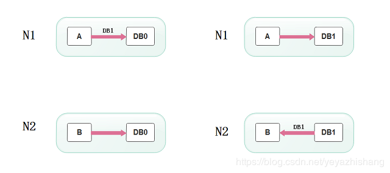
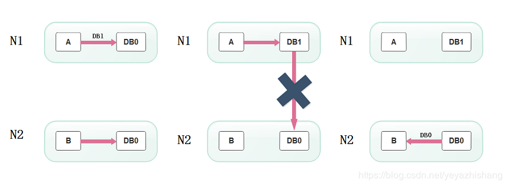

# 分布式CAP定理，为什么不能同时满足三个特性？

​                                                   2018年06月21日 13:55:41           [一个懵懂的少年](https://me.csdn.net/yeyazhishang)           阅读数：18869                                                                  

​                   

​                                                                         版权声明：转载请注明出处，谢谢合作！          https://blog.csdn.net/yeyazhishang/article/details/80758354        

在弄清楚这个问题之前，我们先了解一下什么是分布式的CAP定理。

根据百度百科的定义，CAP定理又称CAP原则，指的是在一个分布式系统中，Consistency（一致性）、 Availability（可用性）、Partition tolerance（分区容错性），最多只能同时三个特性中的两个，三者不可兼得。

## **一、CAP的定义**

Consistency (一致性)：

“all nodes see the same data at the same  time”,即更新操作成功并返回客户端后，所有节点在同一时间的数据完全一致，这就是分布式的一致性。一致性的问题在并发系统中不可避免，对于客户端来说，一致性指的是并发访问时更新过的数据如何获取的问题。从服务端来看，则是更新如何复制分布到整个系统，以保证数据最终一致。

Availability (可用性):

可用性指“Reads and writes always succeed”，即服务一直可用，而且是正常响应时间。好的可用性主要是指系统能够很好的为用户服务，不出现用户操作失败或者访问超时等用户体验不好的情况。

Partition Tolerance (分区容错性):

即分布式系统在遇到某节点或网络分区故障的时候，仍然能够对外提供满足一致性和可用性的服务。

分区容错性要求能够使应用虽然是一个分布式系统，而看上去却好像是在一个可以运转正常的整体。比如现在的分布式系统中有某一个或者几个机器宕掉了，其他剩下的机器还能够正常运转满足系统需求，对于用户而言并没有什么体验上的影响。

## 二、CAP定理的证明

现在我们就来证明一下，为什么不能同时满足三个特性？

假设有两台服务器，一台放着应用A和数据库V，一台放着应用B和数据库V，他们之间的网络可以互通，也就相当于分布式系统的两个部分。

在满足一致性的时候，两台服务器  N1和N2，一开始两台服务器的数据是一样的，DB0=DB0。在满足可用性的时候，用户不管是请求N1或者N2，都会得到立即响应。在满足分区容错性的情况下，N1和N2有任何一方宕机，或者网络不通的时候，都不会影响N1和N2彼此之间的正常运作。                                                

当用户通过N1中的A应用请求数据更新到服务器DB0后，这时N1中的服务器DB0变为DB1，通过分布式系统的数据同步更新操作，N2服务器中的数据库V0也更新为了DB1，这时，用户通过B向数据库发起请求得到的数据就是即时更新后的数据DB1。

上面是正常运作的情况，但分布式系统中，最大的问题就是网络传输问题，现在假设一种极端情况，N1和N2之间的网络断开了，但我们仍要支持这种网络异常，也就是满足分区容错性，那么这样能不能同时满足一致性和可用性呢？

假设N1和N2之间通信的时候网络突然出现故障，有用户向N1发送数据更新请求，那N1中的数据DB0将被更新为DB1，由于网络是断开的，N2中的数据库仍旧是DB0；

如果这个时候，有用户向N2发送数据读取请求，由于数据还没有进行同步，应用程序没办法立即给用户返回最新的数据DB1，怎么办呢？有二种选择，第一，牺牲数据一致性，响应旧的数据DB0给用户；第二，牺牲可用性，阻塞等待，直到网络连接恢复，数据更新操作完成之后，再给用户响应最新的数据DB1。

上面的过程比较简单，但也说明了要满足分区容错性的分布式系统，只能在一致性和可用性两者中，选择其中一个。也就是说分布式系统不可能同时满足三个特性。这就需要我们在搭建系统时进行取舍了，那么，怎么取舍才是更好的策略呢?

## 三、取舍策略

CAP三个特性只能满足其中两个，那么取舍的策略就共有三种：

**CA without P：**如果不要求P（不允许分区），则C（强一致性）和A（可用性）是可以保证的。但放弃P的同时也就意味着放弃了系统的扩展性，也就是分布式节点受限，没办法部署子节点，这是违背分布式系统设计的初衷的。

**CP without A：**如果不要求A（可用），相当于每个请求都需要在服务器之间保持强一致，而P（分区）会导致同步时间无限延长(也就是等待数据同步完才能正常访问服务)，一旦发生网络故障或者消息丢失等情况，就要牺牲用户的体验，等待所有数据全部一致了之后再让用户访问系统。设计成CP的系统其实不少，最典型的就是分布式数据库，如Redis、HBase等。对于这些分布式数据库来说，数据的一致性是最基本的要求，因为如果连这个标准都达不到，那么直接采用关系型数据库就好，没必要再浪费资源来部署分布式数据库。

 **AP wihtout C：**要高可用并允许分区，则需放弃一致性。一旦分区发生，节点之间可能会失去联系，为了高可用，每个节点只能用本地数据提供服务，而这样会导致全局数据的不一致性。典型的应用就如某米的抢购手机场景，可能前几秒你浏览商品的时候页面提示是有库存的，当你选择完商品准备下单的时候，系统提示你下单失败，商品已售完。这其实就是先在  **A**（可用性）方面保证系统可以正常的服务，然后在数据的一致性方面做了些牺牲，虽然多少会影响一些用户体验，但也不至于造成用户购物流程的严重阻塞。

## 三、总结

现如今，对于多数大型互联网应用的场景，主机众多、部署分散，而且现在的集群规模越来越大，节点只会越来越多，所以节点故障、网络故障是常态，因此分区容错性也就成为了一个分布式系统必然要面对的问题。那么就只能在C和A之间进行取舍。但对于传统的项目就可能有所不同，拿银行的转账系统来说，涉及到金钱的对于数据一致性不能做出一丝的让步，C必须保证，出现网络故障的话，宁可停止服务，可以在A和P之间做取舍。

总而言之，没有最好的策略，好的系统应该是根据业务场景来进行架构设计的，只有适合的才是最好的。