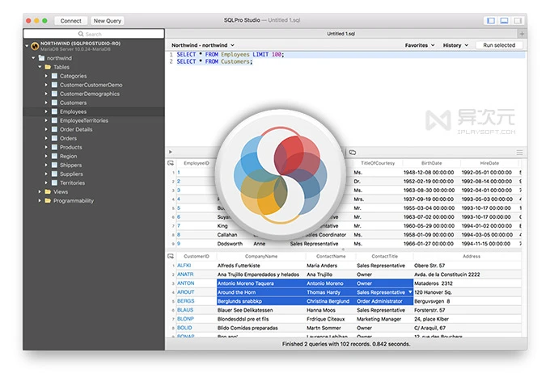

SQLPro Studio 拥有一个直观的用户界面，提供了创建表、自定义查询、自动补全、语法高亮、更新或设计表结构等等功能。

# SQLPro Studio - 数据库管理客户端工具 (原生 macOS 应用)

免费化 ￥700→0				 [编程开发](https://www.iplaysoft.com/category/programming)  [Mac](https://www.iplaysoft.com/os/mac-platform)  2018-05-18

  

22,522 [5](javascript:void(0);) [下载](javascript:void(0);)

**SQLPro Studio** 是一款非常强大实用优秀的 **macOS 数据库客户端工具**，该软件能够帮助用户快速轻松连接管理不同的数据库，适合[开发](https://www.iplaysoft.com/tag/开发)者和学生们使用。

[SQLPro](https://www.iplaysoft.com/p/sqlpro-studio) 原本是一款付费软件，原售价 $109.99 美元 (约合 RMB 701 元人民币)，不过开发商刚刚宣布「已将所有试用限制全部移除」。现在起任何人都可以**完全免费下载和使用 SQLPro 的产品** (不过限制了仅能同时连接1个数据库）。但这对于个人开发者和学生们依然还是一个不错的好消息！

  

SQLPro Studio 软件操作简单，可以支持 **MySQL**、**Microsoft SQL Server**、MariaDB、Postgres、**Oracle**、SQLite 等[数据库](https://www.iplaysoft.com/tag/数据库)。

 SQLPro Studio - 数据库管理客户端工具 (原生 macOS 应用)

https://www.iplaysoft.com/p/sqlpro-studio

SQLPro Studio(多数据库管理工具) v2020.48 Mac破解版

https://www.cr173.com/soft/1204974.html

SQLPro Studio for mac(数据库管理工具)

https://mac.orsoon.com/Mac/178985.html