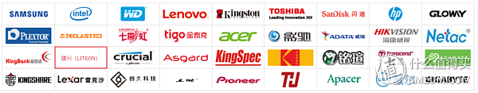
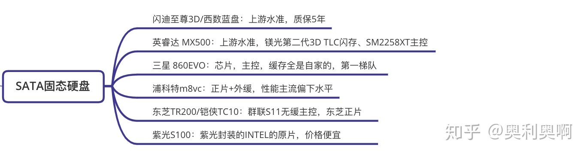

# SSD

# Intel

那些别的牌子所谓oem卖的和我图上^O^清零英特尔s3500一个价甚至更便宜的自己想喽。

为什么二手固态只有英特尔值得买 - Aerofics的文章 - 知乎 https://zhuanlan.zhihu.com/p/82106179

，p4500/p3600/s3610因为英特尔自家主控通电时间是没法清零的

(前排提醒英特尔企业级固态请买代号1/2的别买0的，比如s3700/p4500就是小批量试水的，s3710和p4510才是大批量生产的稳定品)

那款固态硬盘可靠性高？ - Aerofics的文章 - 知乎 https://zhuanlan.zhihu.com/p/81919362

M600 1TB   intel S3500

【卖萌推荐】近期值得买的大船SSD - 渐缜的文章 - 知乎 https://zhuanlan.zhihu.com/p/60382461

# 没找到女朋友的你，不妨先买这些SSD

- 什么值得买的文章 - 知乎 https://zhuanlan.zhihu.com/p/57383206

   硬件接口分为SATA接口、M.2接口、PCI-E接口。传统SATA接口是硬盘数据通过内存传输到CPU运算，运算完毕后再通过内存传输回硬盘。而PCI-E接口是硬盘直接传输给CPU，省去了内存传输的步骤，从而大幅度地提升读写速度。NVMe协议的M.2接口走的是PCI-E通道，而AHCI协议的M.2接口速度和SATA接口的最大速度是一样的，读写速度实际使用不会超过550MB/s。

不同接口协议对应的最大速度

## SSD固态硬盘的品牌

 常见的品牌有：三星、浦科特、闪迪、英特尔、东芝、英睿达、建兴、创见、金士顿、西部数据等等。

**[三星(SAMSUNG) 860 EVO 250G 2.5英寸 SATAIII SSD固态硬盘（MZ-76E250B）359元](https://link.zhihu.com/?target=https%3A//go.smzdm.com/7f4f7981ac03bf96/ca_bb_yc_163_70110399_10335_0_1519_0)**[京东](https://link.zhihu.com/?target=https%3A//go.smzdm.com/7f4f7981ac03bf96/ca_bb_yc_163_70110399_10335_0_1519_0)[去购买](https://link.zhihu.com/?target=https%3A//go.smzdm.com/7f4f7981ac03bf96/ca_bb_yc_163_70110399_10335_0_1519_0)

  主控为三星自家的 MJX 控制器，闪存颗粒为Samsung V-NAND 3bit MLC（PS:3bit MLC是TLC），连续读取不超过550MB/秒，连续写入不超过520MB/秒，五年质保。

**[西部数据(WD) Blue系列 250GB SSD固态硬盘(3D进阶款享五年质保)349元](https://link.zhihu.com/?target=https%3A//go.smzdm.com/3a5fae1046f00d81/ca_bb_yc_163_70110399_10335_0_1519_0)**[京东](https://link.zhihu.com/?target=https%3A//go.smzdm.com/3a5fae1046f00d81/ca_bb_yc_163_70110399_10335_0_1519_0)[去购买](https://link.zhihu.com/?target=https%3A//go.smzdm.com/3a5fae1046f00d81/ca_bb_yc_163_70110399_10335_0_1519_0)

  主控为MARVELL 88SS1074，闪存颗粒为BiCS 64层堆叠3D闪存，顺序读取速度高达550MB/S 顺序写入速度高达525MB/S，五年质保。

**[浦科特（PLEXTOR）M8VC 256G SATA3 SSD固态硬盘359元](https://link.zhihu.com/?target=https%3A//go.smzdm.com/8f2b2225ee92c759/ca_bb_yc_163_70110399_10335_0_1519_0)**[京东](https://link.zhihu.com/?target=https%3A//go.smzdm.com/8f2b2225ee92c759/ca_bb_yc_163_70110399_10335_0_1519_0)[去购买](https://link.zhihu.com/?target=https%3A//go.smzdm.com/8f2b2225ee92c759/ca_bb_yc_163_70110399_10335_0_1519_0)

  主控为慧荣的SM2258H，闪存颗粒为东芝64层3D NAND TLC，持续读取达560 MB/s，持续写入达510MB/s，三年质保。 

**[英特尔（Intel）545S系列 256G SATA3 SSD固态硬盘349元](https://link.zhihu.com/?target=https%3A//go.smzdm.com/9ceac02a9306f1ff/ca_bb_yc_163_70110399_10335_0_1519_0)**[京东](https://link.zhihu.com/?target=https%3A//go.smzdm.com/9ceac02a9306f1ff/ca_bb_yc_163_70110399_10335_0_1519_0)[去购买](https://link.zhihu.com/?target=https%3A//go.smzdm.com/9ceac02a9306f1ff/ca_bb_yc_163_70110399_10335_0_1519_0)

  主控为慧荣的SM2259，闪存颗粒为Intel二代3D TLC NAND，最高顺序读取为550 MB/s，最高顺序写入为500 MB/s，五年质保。

# 小白SSD固态硬盘选购指南 

 喵喵折App的文章 - 知乎 https://zhuanlan.zhihu.com/p/40555331

**SATA接口的传统固态硬盘**
**1.三星860EVO（256GB 459元）** 
推荐指数：★★★★★

**SATA接口最推荐买的一款**，1是因为它是SATA固态硬盘中速度最快的；2是因为三星的SSD超稳定，几乎没见有人说过质量问题的，让人买的放心，买的安心。三星主控+三星TLC颗粒，用5年不是问题，顺序读写535MB/s，4K IPOS 94k。**虽然贵一点，但是速度快，运行稳，用的安心。** 

**2.东芝Q200（240GB 439元）** 
推荐指数：★★★★★

**它最大的特点就是使用东芝的MLC颗粒**，主控由马牌和东芝共同研发，在颗粒和主控上都很好，因此寿命很久很久，顺序读写530MB/s，4K IPOS 74k，**虽然速度不是很快，但持久耐用才是它的优势。** 

**3.建兴T9（256GB 679元）** 
推荐指数：★★★

**它在硬件上可以说是完美，东芝eMLC颗粒（比传统MLC更耐用）+正宗的马牌主控，是SSD最理想的搭配**，寿命在10年以上。顺序读写455MB/s，4k IPOS 77.5k，**虽然速度不快，但他确实更加稳定不掉速，耐用持久，产品是好产品，只不过价格太贵了，所以推荐程度不高。** 

**4.英睿达BX300（240GB 399元）** 
推荐指数：★★★★

**可能是最便宜的MLC颗粒的SSD了。**使用**镁光MLC颗粒**，不过主控稍差，是慧荣主控。顺序读写530MB/s，4K  IPOS为89.5k，速度还是挺快的，性价比很高。不过这款SSD有个驱动上的问题，必须使用微软自带的驱动，不能使用intel的驱动，不然容易产生卡顿的现象。具体方法可以在网上插到，如果不想也不会折腾，就不要考虑这款了。 

**5.英特尔 545s（256GB 499元）** 
推荐指数：★★★★

价格虽然不便宜，但你收获的是更完善的售后服务和更放心的使用体验。这款545s使用自家TLC颗粒+慧荣主控芯片，顺序读写525MB/s，4K IPOS为80k，速度还不错。最重要的是它有5年的优质售后服务，可以放心购买。 

**6.东芝TR200（240GB 329元）** 
推荐指数：★★★

**这款算是低价格里质量性能还算不错的一款，如果预算不多就买这款吧。**TR200在以前是不推荐的，因为它的主控较弱，而且卖的还贵，不过现在它的价格一路下跌，从年初的569元一直降到现在的329元，虽然便宜，但东芝自己家的3DTLC颗粒还是很放心的。速度也不错，可以放心的使用。

**附上本文介绍的几款固态的参数对比：**

# 2020年移动硬盘推荐（机械/固态/移动硬盘盒）

 - 奥利奥啊的文章 - 知乎 https://zhuanlan.zhihu.com/p/149820044

**SATA固态硬盘**

- **闪迪至尊3D/西数蓝盘：**上游水准，质保5年
- **英睿达 MX500：**上游水准，镁光第二代3D TLC闪存、SM2258XT主控
- **三星 860EVO：**芯片，主控，缓存全是自家的，第一梯队
- **浦科特m8vc：**正片+外缓，性能主流偏下水平
- **东芝TR200/铠侠TC10：**群联S11无缓主控，东芝正片
- **紫光S100：**紫光封装的INTEL的原片，价格便宜

# End