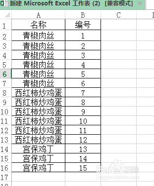
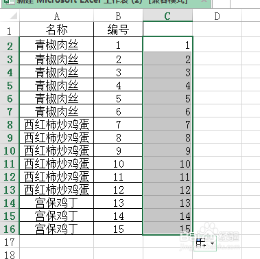
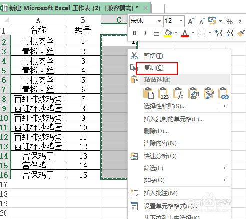
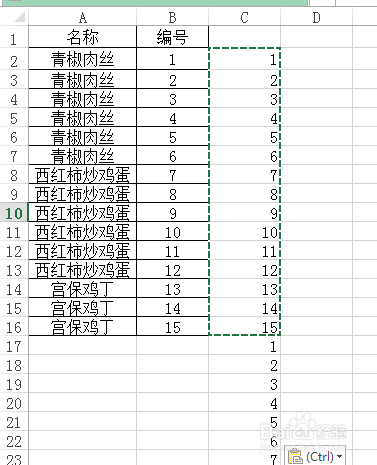
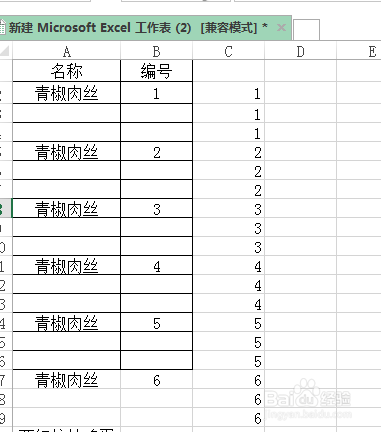
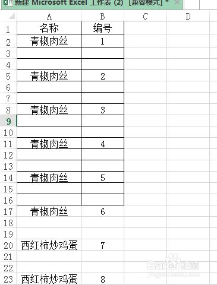
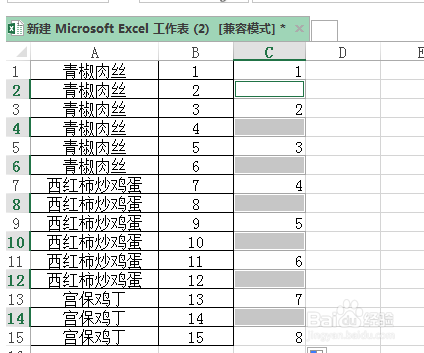
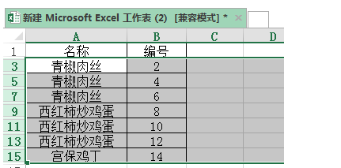

## excel怎么快速每隔一行插入两行空白行 

https://jingyan.baidu.com/article/6c67b1d698c7a22787bb1e92.html

- 
- 2
- 3
- 4
- 5
- 6
- 7

[分步阅读](http://jingyan.baidu.com/album/6c67b1d698c7a22787bb1e92.html)

excel隔一行插入两行和excel隔一行插入一行，技巧差不多，我们来实践操作一下。

## 工具/原料

- excel

## 方法/步骤

1. 

   打开excel表格，做一个简单的数据表格。

   

2. 

   在C2中输入1，选择序列填充至15为止。

   

3. 

   复制1-15表格，快捷键ctrl+c复制.

   

4. 

   然后粘贴两遍到底部位置。

   

5. 

   鼠标放在C单元格上，选择升序，发现有了变化。

   

6. 

   最后把多余的辅助列删除即可。

   29[excel怎样每隔两行插入一行？](https://jingyan.baidu.com/article/08b6a591bc768014a80922f9.html)

   

7. 

   注意：excel中如何隔一行删除一行呢，来学习一下吧。

   30[怎么批量删除excel单元格中隔一行删除一行?](https://jingyan.baidu.com/article/17bd8e5220998e85ab2bb894.html)

   

8. 

   注意：如何隔一行隐藏一行呢？需要用到格式刷哦。

   0[excel表格怎么隔一行隐藏一行？](https://jingyan.baidu.com/article/647f0115c07e987f2148a899.html)

   