https://devopshub.cn/2018/08/30/dotnetcore-vue/

[devopshub.cn](https://devopshub.cn/2018/08/30/dotnetcore-vue/)

# 记一次.net core 集成vue 实践 | DevOps 博客

卢伟

9-11 分钟

------

## 背景

最近在做一个项目，有前端也有后端，基于这辈子再也不可能写es5了（原生js还是很重要滴），所以毅然决然的放弃了采用服务端渲染前端，但是呢，基于项目前期的规模不大，所以考虑把前后端放在一个repo里边，当然发布也是同一网站路径咯。这样有一个好处就是不用考虑跨域的问题，将来如果分离重构的话也不困难，只需把跨域问题解决即可，无论是.net  core的cros还是Nginx反代都可以很好的解决跨域问题。react、angular、vue，其中我最熟悉的就是vue，所以采用了vue（全家桶）来实现前端业务。在我们的项目中我将vue的打包发布集成到了.net core编译中，也就是说我在编译.net core 项目的同时完成了前端的npm install 和npm run  build。下文将会已一个简单实例实现.net core 集成vue。
 附上源码地址：https://github.com/WalkerLu/DotnetCoreWithVue.git

## 要求

需要你的计算机安装有
 • .net core 2.0以上版本
 • node、webpack、vue-cli、vue （npm install 默认版本即可）
 • visual studio 2017/vs code

## 初始化.net core 项目

\1. 首先打开vs 17(vs code也行)新建一个asp.net core 项目DotnetCoreWithVue[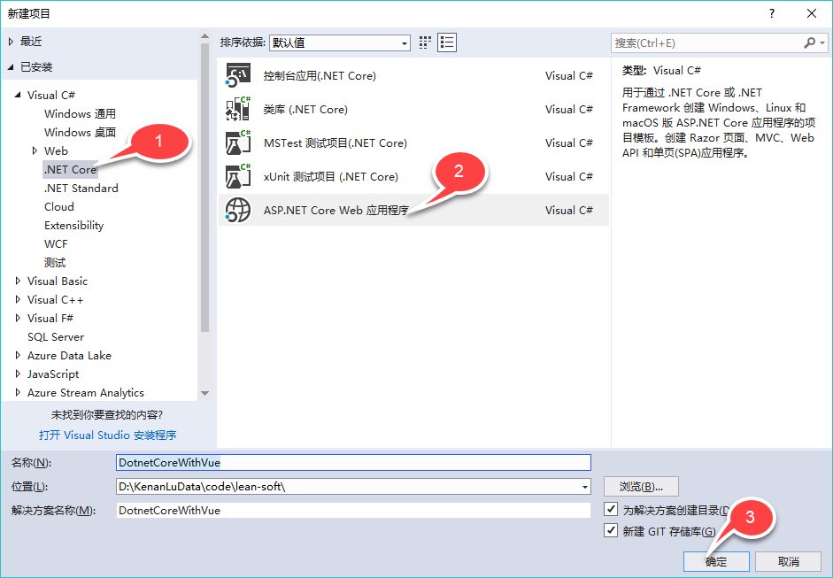](https://devopshub.cn/wp-content/uploads/2018/08/core-vue1.png)

\2. 选择API模板，若是想集成docker可以勾选下启用docker支持。关于docker的详细介绍可参考我们的另一篇文章使用[TFS玩转Docker自动化部署](https://devopshub.cn/2018/08/10/tfs-devops-pipeline-with-docker/)[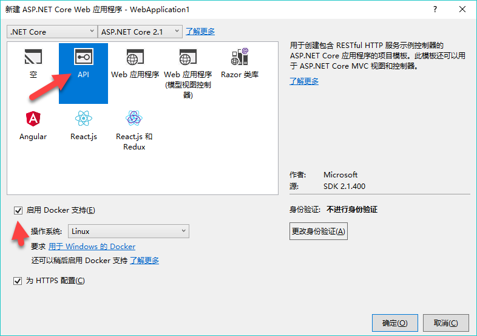](https://devopshub.cn/wp-content/uploads/2018/08/core-vue2.png)[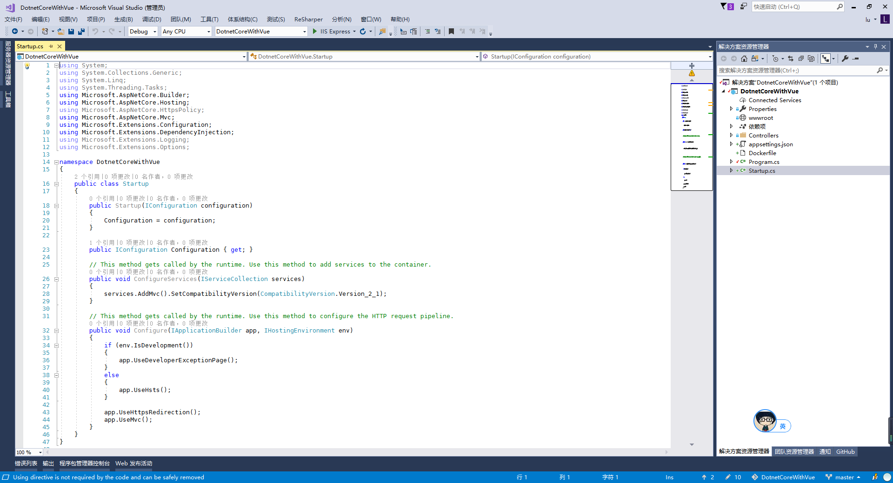](https://devopshub.cn/wp-content/uploads/2018/08/core-vue3.1.png)

## 使用vue-cli初始化vue 项目

• 若未安装node,点击下[载链接](https://nodejs.org/dist/v8.11.4/node-v8.11.4-x64.msi)，双击安装即可
 • 若未安装vue输入命令行 npm install -g vue
 • 安装vue-cli npm install -g vue-cli。Npm慢的话可以使用cnpm（淘宝npm镜像）或者yarn.

\1. 打开命令行工具，这里直接使用的vscode的终端插件[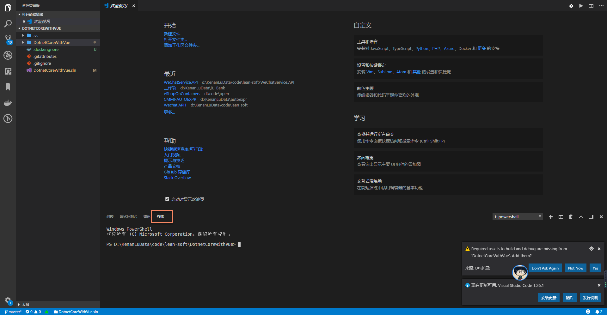](https://devopshub.cn/wp-content/uploads/2018/08/core-vue3.png)

\2. 用webpack 初始化vue,这里我选择了使用vue路由、ESLint语法规范，另外两个测试模块暂时用不到都填n，关于vue webpack 模板的介绍可参考文：https://vuejs-templates.github.io/webpack/
 vue init webpack[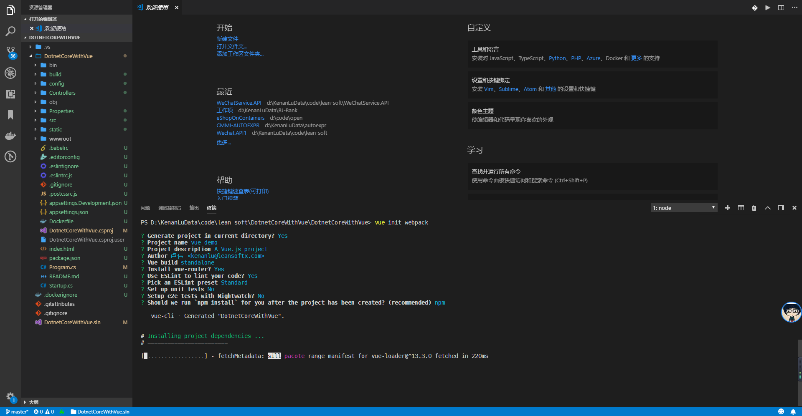](https://devopshub.cn/wp-content/uploads/2018/08/core-vue4.png)

\3. 安装依赖
 cd DotnetCoreWithVue
 npm install[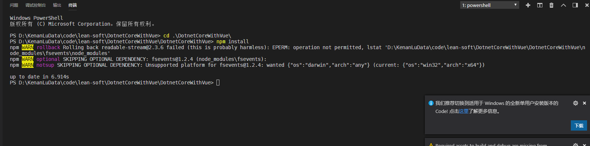](https://devopshub.cn/wp-content/uploads/2018/08/core-vue5.png)

\4. 校验项目是否初始化成功
 npm run dev,在浏览器中打开http://localhost:8080,看到如下页面代表vue项目初始化成功。[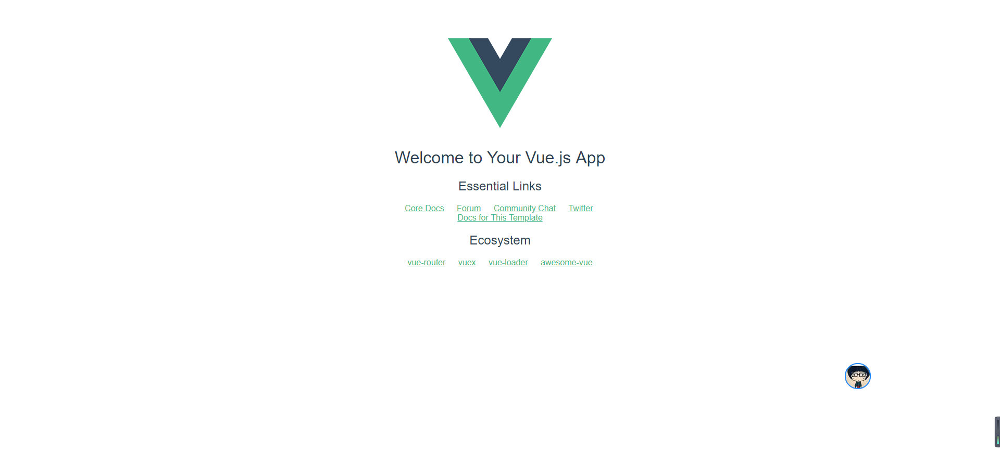](https://devopshub.cn/wp-content/uploads/2018/08/core-vue6.png)

## 编写项目文件

通过编译项目文件，在项目文件编译前先执行npm命令

\1. 在vs 2017 中选中.csproj文件右键修改[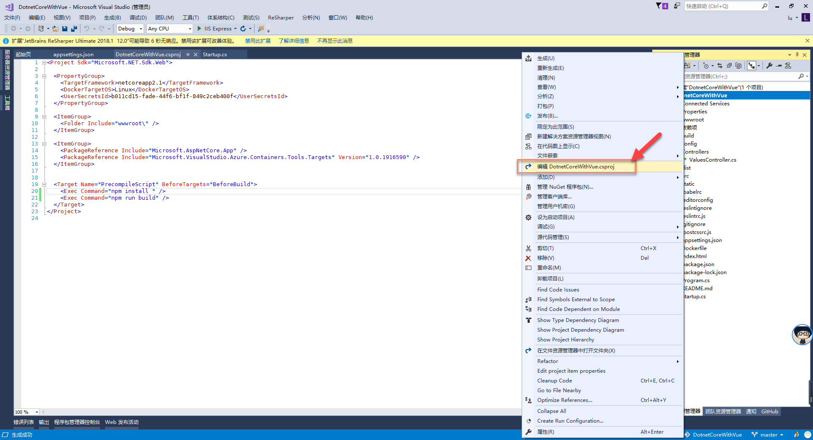](https://devopshub.cn/wp-content/uploads/2018/08/core-vue7.png)

\2. 在.csproj 文件中添加如下代码，即表示在构建之前先执行 npm install 和npm run build
 <Target Name=”PrecompileScript” BeforeTargets=”BeforeBuild”>
 <Exec Command=”npm install ” />
 <Exec Command=”npm run build” />
 </Target>

\3. 编译查看结果，可以在输出控制台查看日志[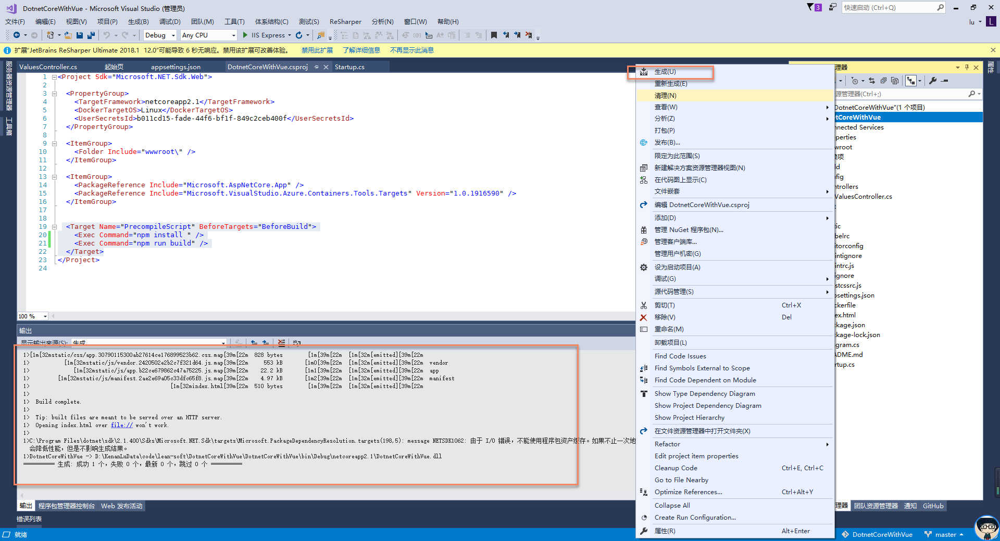](https://devopshub.cn/wp-content/uploads/2018/08/core-vue8.png)

查看生成目录[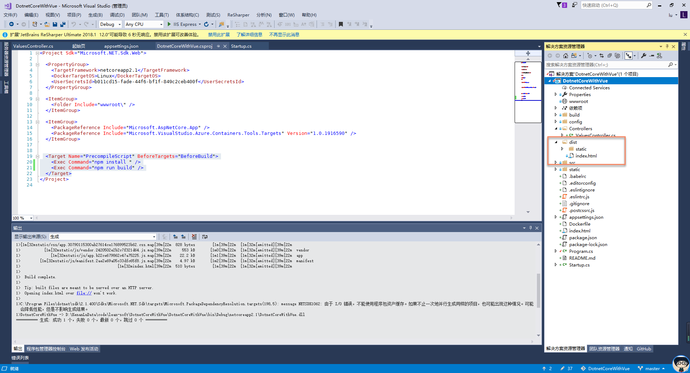](https://devopshub.cn/wp-content/uploads/2018/08/core-vue9.png)

## 修改webpack发布到wwwroot 目录

在asp.net core 项目中我们习惯将静态文件放到wwwroot 目录下，现在我们只需修改下webpack 配置文件即可。

\1. 修改conf/index.js 文件[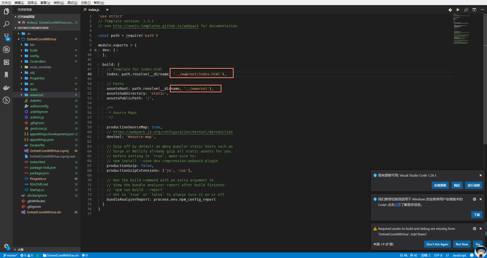](https://devopshub.cn/wp-content/uploads/2018/08/core-vue10.png)

\2. 重新编译，查看生成文件路径[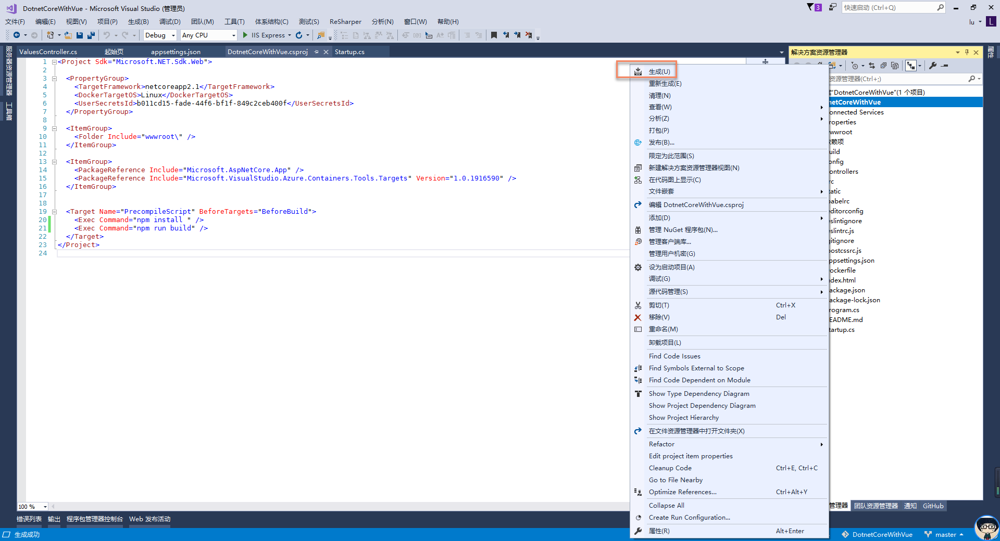](https://devopshub.cn/wp-content/uploads/2018/08/core-vue11.png)

## 前后端交互

\1. 修改controller的第一个方法，将返回数据第一个改为：dotnet core with vue[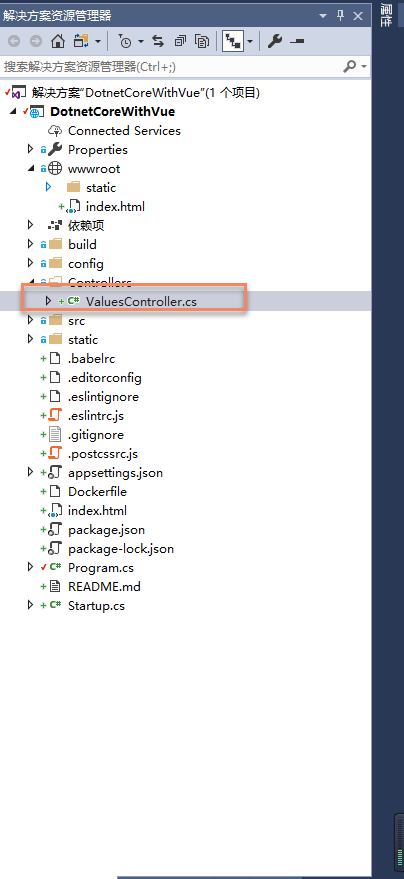](https://devopshub.cn/wp-content/uploads/2018/08/core-vue14.png)

// GET api/values
 [HttpGet]
 public ActionResult<IEnumerable<string>> Get()
 {
 return new string[] { “dotnet core with vue”, “value2” };
 }

\2. 修改HelloWorld.vue，添加如下代码，请求后端api，然后编译项目。这里使用的requst 为小编封装的axios，各位感兴趣的话可以直接去github 查看[代码](https://github.com/WalkerLu/DotnetCoreWithVue/blob/master/DotnetCoreWithVue/src/utils/request.js)

[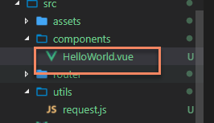](https://devopshub.cn/wp-content/uploads/2018/08/core-vue15.png)
 mounted () {
 request({
 url: ‘api/values’,
 method: ‘get’
 }).then(response => {
 console.log(response)
 this.msg = response.data[0]
 })
 }

\3. 请求http://localhost:40051/#/ 验证代码，这里的端口号需自行修改。[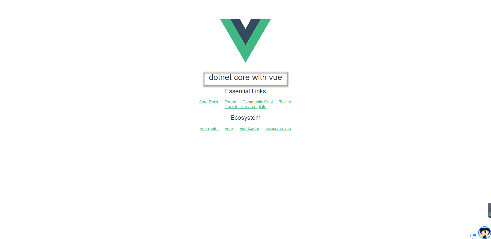](https://devopshub.cn/wp-content/uploads/2018/08/core-vue16.png)

## 总结

至此.net core 集成vue的基本操作都完成了，其中用的技术（.net  core、vue、router、webpack、es6…）展开了来讲都可以出一个系列了，当然网上也不乏文档资料。故此文的的侧重点在于如何开始dotnet core with vue ？对于技术细节也没有深入探讨，如果读者有.net core 获取vue  前端方面的话题或问题欢迎大家积极留言评论，我们一起探讨学习。当然咯，重构前端也好，前后端分离也好都需要切合实际的选择最合适自己的方案。如果你刚好前后端都是同一个部门在开发的话，或许可以试试这种方式。

\- leansoftx.com -

​          

----

# Second

[首页](https://devopshub.cn/)  [公司博客](https://devopshub.cn/category/companyblog/)  记一次.net core 集成vue 实践

- [公司博客](https://devopshub.cn/category/companyblog/)
- [软件工程](https://devopshub.cn/category/software-engineering/)

# 记一次.net core 集成vue 实践

.net  core、vue、router、webpack、es6…  ,每一个展开了来讲都可以出一个系列了，当然网上也不乏文档资料。故此文的的侧重点在于如何开始dotnet core with vue  ？对于技术细节也没有深入探讨，如果读者有.net core 获取vue  前端方面的话题或问题欢迎大家积极留言评论，我们一起探讨学习。当然咯，重构前端也好，前后端分离也好都需要切合实际的选择最合适自己的方案。如果你刚好前后端都是同一个部门在开发的话，或许可以试试这种方式

由

[卢伟](https://devopshub.cn/author/kenanlu/)

 \- 

2018年8月30日

[0](https://devopshub.cn/2018/08/30/dotnetcore-vue/#respond)

3091

## 背景

最近在做一个项目，有前端也有后端，基于这辈子再也不可能写es5了（原生js还是很重要滴），所以毅然决然的放弃了采用服务端渲染前端，但是呢，基于项目前期的规模不大，所以考虑把前后端放在一个repo里边，当然发布也是同一网站路径咯。这样有一个好处就是不用考虑跨域的问题，将来如果分离重构的话也不困难，只需把跨域问题解决即可，无论是.net  core的cros还是Nginx反代都可以很好的解决跨域问题。react、angular、vue，其中我最熟悉的就是vue，所以采用了vue（全家桶）来实现前端业务。在我们的项目中我将vue的打包发布集成到了.net core编译中，也就是说我在编译.net core 项目的同时完成了前端的npm install 和npm run  build。下文将会已一个简单实例实现.net core 集成vue。
 附上源码地址：https://github.com/WalkerLu/DotnetCoreWithVue.git

## 要求

需要你的计算机安装有
 • .net core 2.0以上版本
 • node、webpack、vue-cli、vue （npm install 默认版本即可）
 • visual studio 2017/vs code

## 初始化.net core 项目

\1. 首先打开vs 17(vs code也行)新建一个asp.net core 项目DotnetCoreWithVue

\2. 选择API模板，若是想集成docker可以勾选下启用docker支持。关于docker的详细介绍可参考我们的另一篇文章使用[TFS玩转Docker自动化部署](https://devopshub.cn/2018/08/10/tfs-devops-pipeline-with-docker/)

## 使用vue-cli初始化vue 项目

• 若未安装node,点击下[载链接](https://nodejs.org/dist/v8.11.4/node-v8.11.4-x64.msi)，双击安装即可
 • 若未安装vue输入命令行 npm install -g vue
 • 安装vue-cli npm install -g vue-cli。Npm慢的话可以使用cnpm（淘宝npm镜像）或者yarn.

\1. 打开命令行工具，这里直接使用的vscode的终端插件

\2. 用webpack 初始化vue,这里我选择了使用vue路由、ESLint语法规范，另外两个测试模块暂时用不到都填n，关于vue webpack 模板的介绍可参考文：https://vuejs-templates.github.io/webpack/
 vue init webpack

\3. 安装依赖
 cd DotnetCoreWithVue
 npm install

\4. 校验项目是否初始化成功
 npm run dev,在浏览器中打开http://localhost:8080,看到如下页面代表vue项目初始化成功。

## 编写项目文件

通过编译项目文件，在项目文件编译前先执行npm命令

\1. 在vs 2017 中选中.csproj文件右键修改

\2. 在.csproj 文件中添加如下代码，即表示在构建之前先执行 npm install 和npm run build
 <Target Name=”PrecompileScript” BeforeTargets=”BeforeBuild”>
 <Exec Command=”npm install ” />
 <Exec Command=”npm run build” />
 </Target>

\3. 编译查看结果，可以在输出控制台查看日志

查看生成目录

## 修改webpack发布到wwwroot 目录

在asp.net core 项目中我们习惯将静态文件放到wwwroot 目录下，现在我们只需修改下webpack 配置文件即可。

\1. 修改conf/index.js 文件

\2. 重新编译，查看生成文件路径[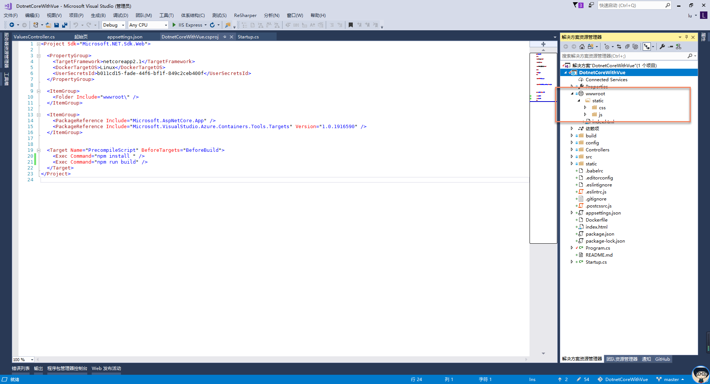](https://devopshub.cn/wp-content/uploads/2018/08/core-vue12.png)

## 前后端交互

\1. 修改controller的第一个方法，将返回数据第一个改为：dotnet core with vue

// GET api/values
 [HttpGet]
 public ActionResult<IEnumerable<string>> Get()
 {
 return new string[] { “dotnet core with vue”, “value2” };
 }

\2. 修改HelloWorld.vue，添加如下代码，请求后端api，然后编译项目。这里使用的requst 为小编封装的axios，各位感兴趣的话可以直接去github 查看[代码](https://github.com/WalkerLu/DotnetCoreWithVue/blob/master/DotnetCoreWithVue/src/utils/request.js)

 mounted () {
 request({
 url: ‘api/values’,
 method: ‘get’
 }).then(response => {
 console.log(response)
 this.msg = response.data[0]
 })
 }

\3. 请求http://localhost:40051/#/ 验证代码，这里的端口号需自行修改。

## 总结

至此.net core 集成vue的基本操作都完成了，其中用的技术（.net  core、vue、router、webpack、es6…）展开了来讲都可以出一个系列了，当然网上也不乏文档资料。故此文的的侧重点在于如何开始dotnet core with vue ？对于技术细节也没有深入探讨，如果读者有.net core 获取vue  前端方面的话题或问题欢迎大家积极留言评论，我们一起探讨学习。当然咯，重构前端也好，前后端分离也好都需要切合实际的选择最合适自己的方案。如果你刚好前后端都是同一个部门在开发的话，或许可以试试这种方式。

END