# [Web API 强势入门指南](https://www.cnblogs.com/guyun/p/4589115.html)

Web API是一个[比较宽泛的概念](http://en.wikipedia.org/wiki/Web_API)。这里我们提到Web API特指ASP.NET Web API。

这篇文章中我们主要介绍Web API的**主要功能**以及**与其他同类型框架的对比**，最后通过一些相对复杂的实例展示**如何通过Web API构建http服务**，同时也展示了Visual Studio构建.net项目的各种强大。

# 目录

- [什么是 Web API](http://www.cnblogs.com/guyun/p/4589115.html#what)
- [为什么要用 Web API](http://www.cnblogs.com/guyun/p/4589115.html#why)
- [功能简介](http://www.cnblogs.com/guyun/p/4589115.html#features)
- [Web API vs MVC](http://www.cnblogs.com/guyun/p/4589115.html#vsmvc)
- [Web API vs WCF](http://www.cnblogs.com/guyun/p/4589115.html#vswcf)
- Web API 实战 （Web API + MongoDB + knockoutjs) 
  - [涉及技术](http://www.cnblogs.com/guyun/p/4589115.html#technique)
  - [服务URI Pattern](http://www.cnblogs.com/guyun/p/4589115.html#uripattern)
  - [准备工作](http://www.cnblogs.com/guyun/p/4589115.html#preparation)
  - [代码实现](http://www.cnblogs.com/guyun/p/4589115.html#implementation)

# 什么是 Web API

官方定义如下，强调两个关键点，即可以**对接各种客户端**（浏览器，移动设备），**构建http服务**的框架。

> ASP.NET Web API is a **framework** that makes it easy to build **HTTP services** that reach **a broad range of clients**,  including browsers and mobile devices. ASP.NET Web API is an ideal  platform for building RESTful applications on the .NET Framework.

[Web API](http://www.asp.net/web-api)在ASP.NET完整框架中地位如下图，与[SignalR](http://www.asp.net/signalr)一起同为构建Service的框架。Web API负责构建http常规服务，而SingalR主要负责的是构建实时服务，例如股票，聊天室，在线游戏等实时性要求比较高的服务。

[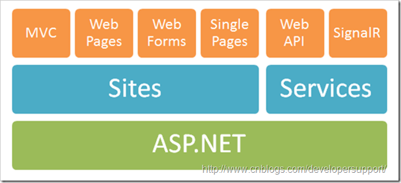](https://images0.cnblogs.com/blog/502305/201309/06170415-7a32a0e46fec45febe133f7f84869f0d.png)

 

# 为什么要用 Web API

Web  API最重要的是可以构建面向各种客户端的服务。另外与WCF REST Service不同在于，Web  API利用Http协议的各个方面来表达服务(例如 URI/request response  header/caching/versioning/content format)，因此就省掉很多配置。

[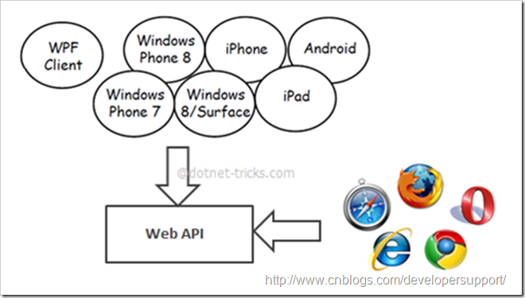](https://images0.cnblogs.com/blog/502305/201309/06170417-ffca034a09db49608782fa7aec324b43.png)

 

当你遇到以下这些情况的时候，就可以考虑使用Web API了。

- 需要Web Service但是不需要SOAP
- 需要在已有的WCF服务基础上建立non-soap-based http服务
- 只想发布一些简单的Http服务，不想使用相对复杂的WCF配置
- 发布的服务可能会被带宽受限的设备访问
- 希望使用开源框架，关键时候可以自己调试或者自定义一下框架

# 功能简介

Web API的主要功能

\1. 支持基于Http verb (GET, POST, PUT, DELETE)的CRUD (create, retrieve, update, delete)操作

​    通过不同的http动作表达不同的含义，这样就不需要暴露多个API来支持这些基本操作。

\2. 请求的回复通过Http Status Code表达不同含义，并且客户端可以通过[Accept header](http://www.w3.org/Protocols/rfc2616/rfc2616-sec14.html)来与服务器协商格式，例如你希望服务器返回JSON格式还是XML格式。

\3. 请求的回复格式支持 JSON，XML，并且可以扩展添加其他格式。

\4. 原生支持[OData](http://www.odata.org/)。

\5. 支持Self-host或者IIS host。

\6. 支持大多数MVC功能，例如Routing/Controller/Action Result/Filter/Model Builder/IOC Container/Dependency Injection。

# Web API vs MVC

你可能会觉得Web API 与MVC很类似，他们有哪些不同之处呢？先上图，这就是他们最大的不同之处。

[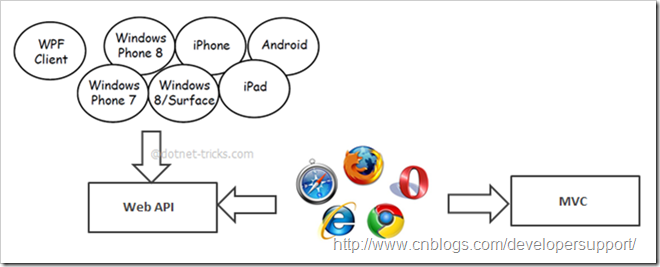](https://images0.cnblogs.com/blog/502305/201309/06170419-f5c577398f2e43ffb9a380bf42fab2ab.png)

详细点说他们的区别，

- MVC主要用来构建网站，既关心数据也关心页面展示，而Web API只关注数据
- Web API支持格式协商，客户端可以通过Accept header通知服务器期望的格式
- Web API支持Self Host，MVC目前不支持
- Web API通过不同的http verb表达不同的动作(CRUD)，MVC则通过Action名字表达动作
- Web API内建于ASP.NET System.Web.Http命名空间下，MVC位于System.Web.Mvc命名空间下，因此model binding/filter/routing等功能有所不同
- 最后，Web API非常适合构建移动客户端服务

# Web API vs WCF

发布服务在Web API和WCF之间该如何取舍呢？这里提供些简单地判断规则，

- 如果服务需要支持One Way Messaging/Message Queue/Duplex Communication，选择WCF
- 如果服务需要在TCP/Named Pipes/UDP (wcf 4.5)，选择WCF
- 如果服务需要在http协议上，并且希望利用http协议的各种功能，选择Web API
- 如果服务需要被各种客户端(特别是移动客户端)调用，选择Web API

# Web API 实战 (Web API + MongoDB + knockoutjs)

[ASP.NET](http://www.asp.net/web-api)网站上有很多简单的[Web API实例](http://www.asp.net/web-api/overview/getting-started-with-aspnet-web-api/tutorial-your-first-web-api)，看看贴图和实例代码你就明白怎么用了。这里我们通过一个稍微复杂一点的实例来展示下Web API的功能。

### 涉及技术

在我们的实例里面用到了：

- [Mongo DB](http://www.mongodb.org/)数据库保存数据 ([NoSQL](http://en.wikipedia.org/wiki/NoSQL), [Document Store](http://en.wikipedia.org/wiki/Document-oriented_database)，跨平台，跨语言)
- Web API提供数据服务
- MVC作数据展示
- [Knockoutjs](http://knockoutjs.com/)动态绑定客户端数据，这里有一个[简单的介绍](http://msdn.microsoft.com/en-us/magazine/hh781029.aspx)

### 服务URI Pattern

| **Action**            | **Http verb** | **URI**              |
| --------------------- | ------------- | -------------------- |
| Get contact list      | GET           | /api/contacts        |
| Get filtered contacts | GET           | /api/contacts?$top=2 |
| Get contact by ID     | GET           | /api/contacts/id     |
| Create new contact    | POST          | /api/contacts        |
| Update a contact      | PUT           | /api/contacts/id     |
| Delete a contact      | DELETE        | /api/contacts/id     |

### 准备工作

\1. 下载并安装Mongo DB，步骤看[这里](http://www.mongodb.org/display/DOCS/Quickstart+Windows)。

\2. Mongo DB C# driver下载可以在nuget搜索mongocsharpdriver。

\3. 如果想本地察看数据库中内容，下载[MongoVUE](http://www.mongovue.com/MongoVUE)。

\4. Knockoutjs下载可以在nuget搜索knockoutjs。

### 代码实现

**1. 创建项目**

创建MVC4 Web Application

[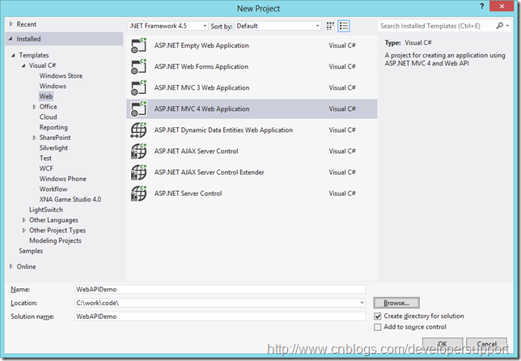](https://images0.cnblogs.com/blog/502305/201309/06215534-de8fd32b120a4a389f0cb7f772ec45c9.png)

在Project Template中选择Web API

然后项目就创建成了，Controllers里面有一个ValuesController，是自动生成的一个最简单的Web API Controller。

正如我们前面所说，里面引用的是System.Web.Http命名空间。

**2. 创建model**

在model里面添加Contact类

[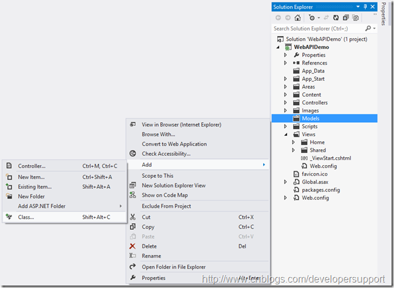](https://images0.cnblogs.com/blog/502305/201309/06215543-954df95187894568a13df1a5c731adf9.png)

代码如下，其中BsonId需要mongocsharpdriver。

我们需要添加mongosharpdriver。

[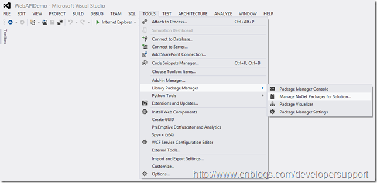](https://images0.cnblogs.com/blog/502305/201309/06215547-1b5dc52ba0e94181bf038aad0cf2a399.png)

[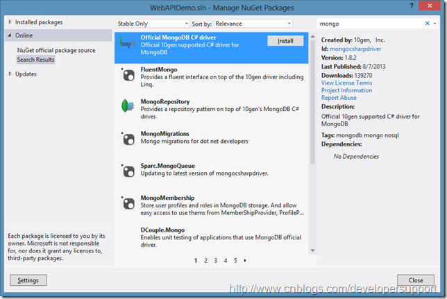](https://images0.cnblogs.com/blog/502305/201309/06215549-417f0b0c972743a29a6a18f5a4b899bc.png)

另外我们需要在Model中添加Repository，Controller通过该类来访问Mongo DB。

ContactRepository的完整实现如下，

**3. 添加Controller**

右键Controllers目录选择添加Controller

****

选择Empty API controller，将Controller命名为ContactsController

添加如下代码，可以看到Controller中的API方法名就是以http verb命名的。

**4. 添加View**

首先添加Knockoutjs库，

[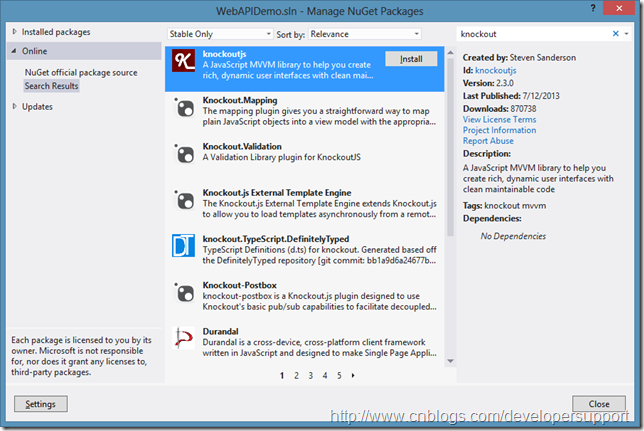](https://images0.cnblogs.com/blog/502305/201309/06215557-2641175bf0ed4d618625dd05bf50c9aa.png)

Knockoutjs通过MVVM模式来实现动态html绑定数据，如下图，其中View-Model是客户端的javascript object保存的model数据。

先打开HomeController，里面添加一个新的Action代码如下，因为我们要在MVC中对于ContactsController添加对应的View。

然后右键Admin方法，选择添加View

[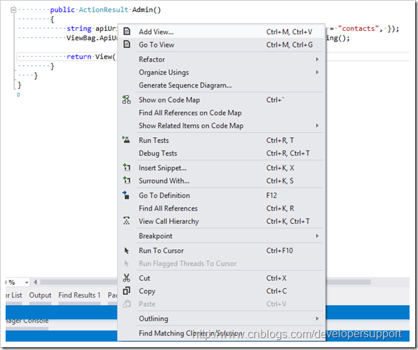](https://images0.cnblogs.com/blog/502305/201309/06215601-371b16b5535141eaba6c91682ed716df.png)

选择Create strongly-typed view，在model class中选择Contact类。

[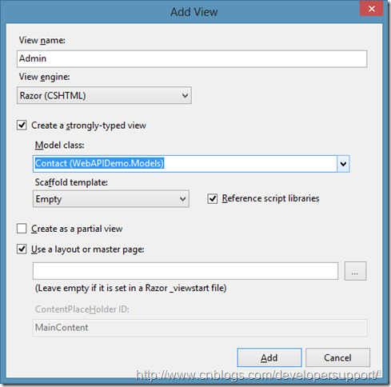](https://images0.cnblogs.com/blog/502305/201309/06234745-931e6c30a58c46279c738c8fe9d7b172.png)

添加View的完整代码，注意view中我们通过js去访问WebAPI，以及通过动态绑定将数据呈现在网页上。

接下来在_layout.cshtml中添加一个admin页面的链接如下

**5. 测试与调试**

大功告成，直接运行下我们的作品，我们的admin链接也显示在右上角，

[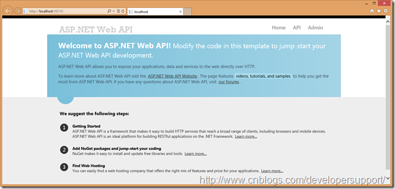](https://images0.cnblogs.com/blog/502305/201309/06234747-27e5e060952242d5a965ca6666d9da5e.png)

Admin页面的样子，Contact list是动态加载进来的，可以通过这个页面做添加，修改，删除的操作。

[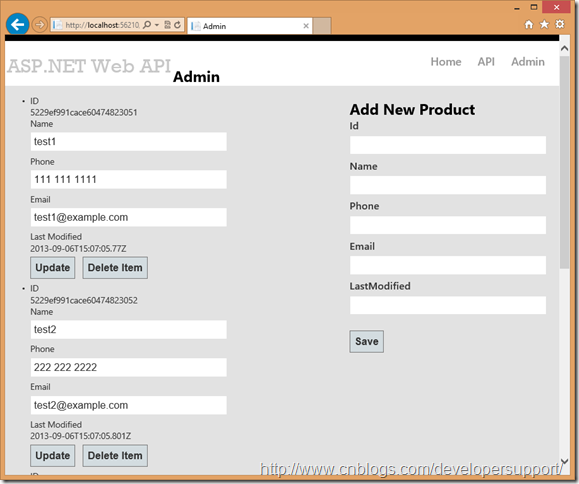](https://images0.cnblogs.com/blog/502305/201309/06234748-d23195cb512b47ad8df4c1c9ef00e2bf.png)

通过IE network capture来查看请求内容，

重新加载页面，可以看到回复的格式为JSON，

[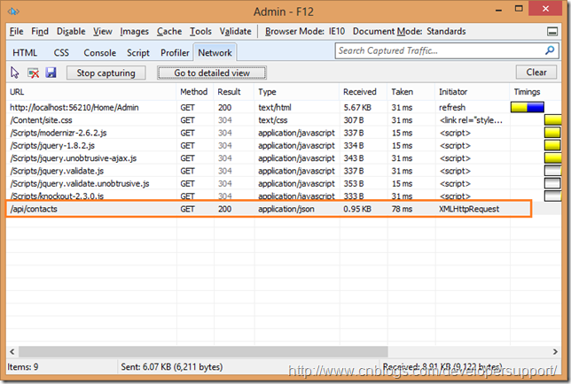](https://images0.cnblogs.com/blog/502305/201309/06234749-2f5a3ebe7cbb4224bcc461c96d614702.png)

JSON内容就是我们mock的一些数据。

接下来我们修改，删除，又添加了一条记录，可以看到使用了不同的http method。

[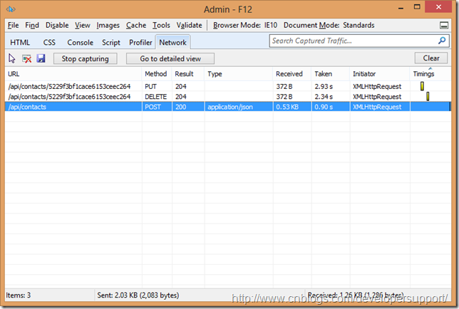](https://images0.cnblogs.com/blog/502305/201309/06234752-01a5aa9e0f4942ff806f375d897e030d.png)

通过前面安装的mongovue来查看下DB种的数据，先添加的user也在其中，令我感到欣慰。。。

[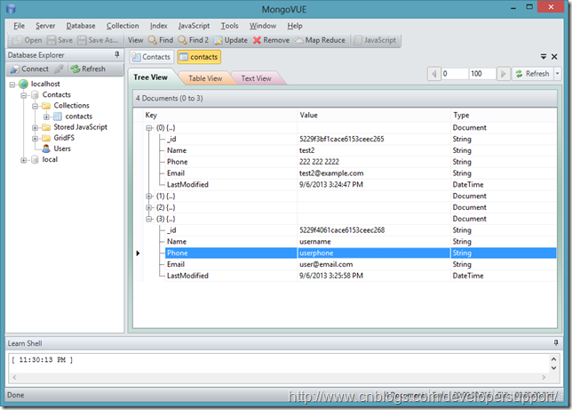](https://images0.cnblogs.com/blog/502305/201309/06234754-8fb63dab400643aab7ae0d2843345195.png)

其实还有两个有趣的实例，不过文章一写就长了，不好意思耽误大家时间，只好先放放，以后再写。

| **博客地址** | <http://www.cnblogs.com/guyun/>                              |
| ------------ | ------------------------------------------------------------ |
| **博客版权** | 本文以学习、研究和分享为主，欢迎转载，但必须在文章页面明显位置给出原文连接。 如果文中有不妥或者错误的地方还望高手的你指出，以免误人子弟。如果觉得本文对你有所帮助不如【推荐】一下！如果你有更好的建议，不如留言一起讨论，共同进步！ 再次感谢您耐心的读完本篇文章。 |
| **给我打赏** |             |

分类: [C#](https://www.cnblogs.com/guyun/category/475174.html)

标签: [webapi](https://www.cnblogs.com/guyun/tag/webapi/)

​         [好文要顶](javascript:void(0);)             [关注我](javascript:void(0);)     [收藏该文](javascript:void(0);)     ;)     ;) 

​             [Napoléon](https://home.cnblogs.com/u/guyun/)
​             [关注 - 3](https://home.cnblogs.com/u/guyun/followees)
​             [粉丝 - 106](https://home.cnblogs.com/u/guyun/followers)         

​                 [+加关注](javascript:void(0);)     

​         38     

​         0     

​     

[« ](https://www.cnblogs.com/guyun/p/4588674.html) 上一篇：[JSON和JSONP的区别](https://www.cnblogs.com/guyun/p/4588674.html)
[» ](https://www.cnblogs.com/guyun/p/4589125.html) 下一篇：[Web API 入门指南 - 闲话安全](https://www.cnblogs.com/guyun/p/4589125.html)

