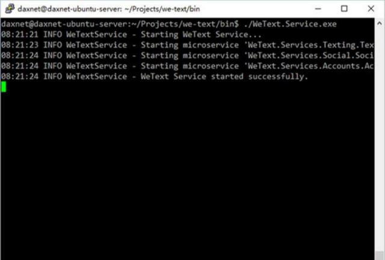

# [基于.NET实现的DDD、CQRS与微服务架构的演示案例](https://342104628.iteye.com/blog/2411959)

最近出于工作需要，了解了一下微服务架构（Microservice  Architecture，MSA）。我经过两周业余时间的努力，凭着自己对微服务架构的理解，从无到有，基于.NET打造了一个演示微服务架构的应用程序案例，并结合领域驱动设计（DDD）以及命令查询职责分离（CQRS）体系结构模式，对事件驱动的微服务系统架构进行了一些实战性的探索。现将自己的思考和收获整理成文，分享给大家。

# 微服务架构

在介绍源代码之前，我还是想谈谈微服务架构，虽然网上有很多有关微服务架构的讨论，但我觉得在此再多说一些还是有必要的。大师级人物Martin   Fowler在他谈论微服务的个人主页上提到，微服务并没有一个非常明确的定义。事实上有很多种分布式系统的实现都可以被看成（或者说勉强看成）是面向微服务架构的。就我个人而言，我觉得微服务架构应该满足以下几个特征：

- 整个系统被分为多个业务功能相对独立的一体化架构（Monolithic  Architecture，或称单一化架构）的应用程序（也就是所谓的“微服务”），每个微服务通常遵循标准的分层架构风格或者基于事件驱动的架构风格，能够对自己相关的领域逻辑进行处理，使用本地数据库进行数据存储，并向上层提供相对独立的API接口或者用户界面。每个微服务还可以使用诸如缓存、日志等基础结构层设施，但如果是与其它的微服务公用这些设施，则该基础结构层设施需要满足下面的第三条特征
- 各个微服务之间可以使用以下方式进行通信（参见：http://howtocookmicroservices.com/communication/）

- 同步方式：最为常见的是基于RESTful风格的API，也可以是跨平台、跨语言的Apache Thrift IDL
- 异步方式：使用轻量级的消息通信机制，比如RabbitMQ、Redis等

- 整个系统是“云友好”（cloud-friendly）的。所谓的“云友好”，是指：

- 针对每个微服务，都应该避免单点失败的可能。例如针对一个系统中某个微服务A，需要有至少两个（或以上）的运行实例，并由API网关（API  Gateway）或者负载均衡器（Load  Balancer）根据一定的规则（比如各个A的运行实例的健康程度等）将来自客户端的服务请求分配到任意一个A的运行实例上完成处理
- 针对每个微服务，管理员可以根据一些特定的实时技术指标对这些应用程序的部署进行调整。例如，购物网站的查询服务负载明显要高于订单管理服务，那么管理员可以根据实际情况，增加查询服务的部署量（比如部署3个查询服务的实例），同时减少订单管理服务的部署量。与整个系统单一采用一体化架构相比，这样做的好处是显而易见的，它能够充分利用云端服务器资源，使得每个微服务都能够运行在合理的资源配置状态下，减少资源浪费
- 公有基础结构层服务设施也应该满足避免单点失败的条件，例如数据库服务需要配置Replication/Clustering，消息队列也需要使用类似的fault tolerance策略
- 基于“云友好”的需求，衍生了一大堆的部署和运维问题，比如微服务本身的配置模式（每台机器配置多个实例？还是每台机器配置一个实例？还是每台虚拟机配置一个实例？又或者是将实例配置到类似Docker这样的容器中）？消息队列如何配置才能支持同一个微服务的多个实例不会重复处理相同的消息？基于RESTful的通信如何让客户端找到动态改变的API地址？等等。我想，这些问题并没有一个特定的答案，还是需要根据实际情况来进行判定

相比传统的一体化架构系统，微服务架构系统有着以下一些优势：

- 每个微服务都相对较小，这样更加便于开发和调试
- 每个微服务都相对独立，这样不仅可以使开发人员仅关注在某个业务处理部分，而且还可以针对每个微服务自己的特征，采用不同的技术实现（比如部分微服务使用C#实现，部分使用Java或者Python等）
- 这种独立性使得微服务在容错隔离方面也有很好的表现：比如某个微服务出现了crash等问题，不会导致整个系统不可用，这符合BASE（Basically Available, Soft-state, Eventually consistency）理念
- 由于相对独立，微服务架构的设计能够更方便地部署到云环境中
- 微服务的独立性还为敏捷开发提供了很好的支持。比如每个服务都可以单独开发单独部署，同时项目团队还能根据成员本身的技术专长来平衡开发和测试资源

当然，它也有一些不足：

- 开发人员需要应对由分布式架构带来的复杂性。比如如果微服务间采用异步的消息通信机制进行通信，那么就需要遵循由这种消息机制所引入的开发模式（创建消息处理器Message  Handler，转发消息等）。此外，这种架构为测试工作也带来了很多不方便的因素，例如当某些测试用例（Test  Cases）需要涵盖多个微服务的业务时，就需要关注弱一致性分布式事务的执行结果，而这往往是比较复杂的。更进一步，这种测试工作还需要多个团队的协调才能顺利进行，当各个团队分布在全球各个国家各个地区时，协调工作更是变得复杂甚至难以进行
- 在生产环境中部署、安装和管理基于微服务架构的系统也不是件容易的事情。这需要客户方有着较强的专业技术背景和解决问题的能力。当然，一种更好的方式是以SaaS的方式直接将服务提供给消费者
- 较多的资源消耗。出于隔离和容错需要，微服务有可能被部署为N个实例，每个实例运行于独立的虚拟系统中。假设部署策略不当造成系统资源存在一定的浪费，那么这种浪费也有可能被扩大N倍

有关微服务架构的内容暂时就写这么多吧，微服务架构现在比较火爆，大家也可以直接上网查阅相关资料，英语比较好的朋友建议直接上英文网站去搜索学习，有很多精华文章和精彩讨论。架构本身就是仁者见仁智者见智，不同的人有不同的理解，产生了不同的观点，有些观点可能在有些场景下更为合适，但换个场景又体现了它的弱势。但不管怎样，我想说的是，无论选择什么架构，它总有优缺点，架构设计的难处就在于如何选择最为合适的模式、方法、技术来完成一整套系统开发的解决方案。更多情况下，整个应用系统更有可能是融合了多种技术多种架构风格的“生态圈”。对于你现在正在开发的项目，或许使用经典的三层架构最为合适。

# WeText项目

有理论还需要实践。为此，我花了两周的业余时间，使用Visual Studio  2015开发了一个案例项目：WeText。这个案例项目的业务还是很简单的：用户可以注册、登录，登录后可以修改个人信息，然后可以创建一些自己的Text（就是含有标题和文本内容的小笔记），还可以发送加好友申请给其他用户，等对方接受邀请后，可以将自己的Text分享给对方。到我写本文为止，Text分享部分还没有完成，但其它业务部分基本已经走通，可能还有不少Bug。

看到这里，你肯定会要吐槽了，这么简单的系统还需要花两周，搞出这么大动静，还有这么多Bug，居然还没搞完！是的，目前还不太完善，为什么？因为架构复杂，我是边思考边设计边Coding，或许使用CQRS的微服务架构并不适合这样的应用系统，甚至DDD也未必有用武之地。在这个项目上采用这么个架构风格，老实说，我只是为了实践一下。到目前为止，这个项目还有以下不足之处，还请各位读者忍耐一下。当然，它是开源的（Apache  2.0 License），你觉得没有尽兴的地方也欢迎参与讨论和贡献，提交Pull Request给我就行了。

- CQRS的查询部分采用了关系型数据库，数据库访问层面没有使用ORM，仅实现了Table Data  Gateway模式，但Table Data  Gateway的实现是单表型结构，跨表查询无法完成JOIN操作：有兴趣的朋友可以基于已有的WeText项目自己实现另一套基于ORM的查询机制
- 虽然Web程序主页上宣称采用了Event Sourcing，但实际上我没有在Event  Store中记录任何事件，只是将聚合的最终状态保存在Event  Store中（出于时间考虑，否则再搞一个月也不一定完得成，时间精力耗不起啊）。CQRS没有Event Sourcing，Oh my  god！不过别惊讶，CQRS不一定非要采用Event Sourcing：有兴趣的朋友可以基于已有的WeText项目自己实现Event  Sourcing的功能，但别忘了将Snapshot也一并搞定，这个非常重要！你还可以在WeText上使用成熟的Event  Store框架来完成这部分功能。有结论了别忘了分享出来
- CQRS的命令部分由RESTful API封装。由于命令执行是异步的（仅保证最终一致性），而RESTful  API是同步的，导致RESTful  API无法返回命令执行的最终结果。我在考虑是否还需要引入诸如Akka这样的基于Actor模型的方案来解决这样的问题，但也不一定有效。还在寻求解决方案。有兴趣的朋友可以继续深入地考虑这个问题
- 异常处理部分相对较弱：这部分我会继续加强
- 前端界面（WeText.Web项目）相对较丑，也有一些缺陷，就是简单的使用ASP.NET MVC  5结合Bootstrap做的，没有使用TypeScript+AngularJS、React甚至是jQuery搞一些高大上的用户体验，基本满足对后端业务的支撑。有兴趣的朋友可以扔掉WeText.Web项目，仅使用WeText提供的服务自己开发自己的前端界面
- 暂时还没有完全验证在云端的部署是否可行，理论上可行，但没有完全验证。

# 整体架构

首先，让我们从整体架构角度来了解一下WeText项目的整个结构，以及它所包含的各个组件。

上图中，蓝色部分表示与领域相关的概念，诸如聚合、规约、事件、Saga、仓储等；黄色部分表示微服务，目前有Accounts、Texting以及Social三个微服务；灰色部分表示基础结构层设施，包括基于Owin的Web  API宿主程序、消息队列、Event Store以及数据库等；浅粉红色色块表示一个服务宿主进程（Service Host）。

- 客户端程序通过RESTful API（Web API）将命令请求发送到服务端
- 服务端通过API Gateway或者Load Balancer将请求转发到相应的微服务实例（API Gateway和Load Balancer没有体现在上图中，那是另一件事情，今后我会讨论）
- Web API Controller将请求转换为CQRS的Command，派发到Command Queue
- Command Handler获得Command消息，通过Repository访问Domain（这个过程会牵涉到Snapshot），执行命令操作
- Repository在保存聚合时，会将操作所产生的事件存储到Event Store（这个过程会牵涉到Snapshot），同时将领域事件派发到消息队列Event Queue
- Event Handler在获取到消息后，执行消息相关操作，在Event  Handler中会触发Saga状态的转换，Saga状态变化后，会产生状态变化领域事件，这个领域事件的Event  Handler又会触发另一个Command的发生（理论上应该是在Saga中直接触发Command，但Saga本身也应该是聚合根，因此由Saga直接操作Command派发明显不合理，这部分内容之后再讨论）
- Event Handler会根据需要同时更新Query Database（也就是上图中normalize的步骤）
- 客户端的查询请求会直接经由RESTful API（Web API），通过Table Data Gateway访问Query Database直接完成

对于Service Host，在上图中它同时为三个服务实例提供了宿主环境。事实上，WeText的设计允许Service Host仅宿主其中的某个或者某几个实例，而多个Service Host又可以被部署到多个不同的物理机器上，例如：

于是，在整个环境中，我们有一个Accounts服务实例、两个Texting服务实例和两个Social服务实例。至少在单点失败和服务器资源平衡方面提供了解决方案，当然也带来了不少问题。比如：

- 如何配置API Gateway的路由，使得客户端请求能够根据指定的策略派发到相应的微服务实例上完成处理？
- 对于具有多个实例的微服务，基于Pub/Sub的消息订阅机制如何避免事件或者命令的重复处理？

另外，你会认为基础结构层设施存在单点失败可能，比如RabbitMQ或者数据库。其实这些成熟的产品都有自己的解决方案，比如做数据库集群。或者干脆直接使用AWS或者Azure提供的PaaS服务（消息队列、存储等）。因此，解决这个问题并不困难。

如果想学习Java工程化、高性能及分布式、深入浅出。微服务、Spring，MyBatis，Netty源码分析的朋友可以加我的Java进阶群：694549689，群里有阿里大牛直播讲解技术，以及Java大型互联网技术的视频免费分享给大家

# 开始

为了能够更好地了解WeText整个项目的架构和所使用的技术，建议提前对以下内容做些了解：

- 领域驱动设计（DDD）
- 命令查询职责分离（CQRS）
- 微服务架构（MSA）
- 消息通信模式（Messaging Patterns）：可以参考RabbitMQ官方的学习资料：http://www.rabbitmq.com/getstarted.html

接下来，重要的事情，算了，就说一遍吧，请使用git将项目代码克隆到本地：

> | 1    | `git clone https://github.com/daxnet/we-text.git` |
> | ---- | ------------------------------------------------- |
> |      |                                                   |

然后直接使用Visual Studio 打开WeText.sln文件即可。打开代码后，先别急着运行，让我们先了解一下项目结构。

- Services目录：包含了三个微服务的项目：Accouts（用户账户微服务）、Social（社交微服务）以及Texting（小笔记微服务）
- WeText.Common项目：包含了整个解决方案的基础库
- WeText.Domain项目：领域模型与命令、事件定义
- WeText.DomainRepositories项目：领域仓储的具体实现（MongoDB实现）
- WeText.Messaging.RabbitMq项目：基于RabbitMQ的消息系统实现
- WeText.Querying.MySqlClient项目：基于MySQL的Table Data Gateway实现，用于提供对MySQL数据库的CRU操作（暂不支持Delete）
- WeText.Querying.PostgreSQL项目：基于PostgreSQL的Table Data Gateway实现，用于提供对PostgreSQL数据库的CRU操作（暂不支持Delete）
- WeText.Service项目：微服务的宿主程序，启动后是一个控制台服务端程序（运行时先启动此项目）
- WeText.Tests项目：基于NUnit的单元测试项目，请直接忽略
- WeText.Web项目：前端用户界面项目，在WeText.Service项目启动后，再启动本项目
- 此外，在we-text根目录下，还有一个scripts的子目录，里面包含了针对MySQL和PostgreSQL数据库的初始化脚本（在写此文时，PostgreSQL脚本未加入，之后会加），在后面的安装步骤中会用到

# 外部依赖项（External Dependencies）

首先，WeText仅依赖于一些基础结构层设施所需的相关库，包括：

- MySql.Data
- RabbitMQ.Client
- MongoDB
- Npgsql
- Autofac相关
- Owin相关
- Newtonsoft Json
- log4net
- 与ASP.NET MVC相关的库

除此之外，没有使用任何应用层的开发框架和代码库，所有的代码都是原创并且包含在整个WeText的解决方案中。

其次，服务端基础结构层完全选用诸如Owin、MySQL、RabbitMQ、PostgreSQL等这些能够跨平台的项目和产品，如此一来整个WeText服务端能够完全部署在Linux环境中（其实这也是我想实践的一个部分，验证基于Mono的.NET服务器程序在Linux系统中是否有出色的表现）。没有使用SQL  Server、Entity Framework这些目前更适合运行于Windows平台的产品。

# 安装与运行

首先，为了方便起见，强烈建议将所有的服务和程序安装在同一台机器上。请按以下步骤准备系统环境：

1. 下载源代码（参考上面的git命令）
2. 下载并安装RabbitMQ，安装过程使用默认配置（包括服务端口等等），有关RabbitMQ的安装，请参见：https://www.rabbitmq.com/download.html
3. 下载并安装MongoDB，安装过程使用默认配置（包括服务端口等等），有关MongoDB的安装，请参见：https://docs.mongodb.org/manual/installation/，如安装后需要更改WeText的MongoDB配置，请移步到WeText.DomainRepositories项目下的MongoSetting.cs文件（写本文时还是hard  code在代码里，今后会移到App.config中）
4. 下载并安装MySQL Community  Edition（包含服务器和客户端），安装过程使用默认配置，root密码请采用P@ssw0rd。有关MySQL的安装，请参见：http://dev.mysql.com/doc/refman/5.7/en/installing.html，如果安装后需要更改WeText的MySQL配置，请直接修改WeText.Service项目的App.config文件
5. 如果你打算使用PostgreSQL作为查询数据库，那么你只需要安装PostgreSQL即可，不需要安装MySQL。安装过程也请使用默认配置
6. 使用we-text项目文件夹下scripts目录下的SQL脚本初始化对应的数据库，目前PostgreSQL的脚本还没有加进来，之后会添加

环境准备好之后，就可以试着启动项目了。

在Windows系统中启动并调试项目

1. 使用Visual Studio 2015打开WeText.sln文件
2. 启动WeText.Service项目，应该能看到以下画面：

启动WeText.Web项目，应该能看到以下画面：

4.尝试点击Register注册自己的账户并登录

# 在Linux中编译并启动服务器程序

注意：我目前还没有来得及测试使用WeText.Web站点访问部署在Linux上的服务器，仅试图在Linux环境中编译和启动服务器程序。Web站点程序（WeText.Web）本身暂不打算运行于Linux环境，以后可以尝试。

1. 安装Mono，请根据该页面完成Mono的安装：http://www.mono-project.com/docs/compiling-mono/linux/。建议直接从Release   Package安装，可以到http://download.mono-project.com/sources/mono/下载最新版本的Mono。WeText需要.NET  Framework 4.6.1和C# 6.0的支持
2. 同样需要根据上面的步骤准备系统环境，包括RabbitMQ、MongoDB以及查询数据库的安装和初始化
3. 使用上面的git命令下载源代码
4. 由于目前nuget在Mono下的支持还是有些问题，有些package无法下载，建议可以先在Windows下编译WeText，然后将下载的packages目录上传到Linux中we-textsrc目录下
5. 进入we-textsrc目录，使用该命令完成编译：xbuild /p:TargetFrameworkVersion=v4.6.1 /p:Configuration=ServerDebug WeText.sln。编译可能会出现部分警告，暂时请直接忽略
6. 进入we-textin目录，执行./WeText.Service.exe命令，应该能看到以下画面：

7.如需尝试从WeText.Web站点访问Linux上的服务，暂时请在WeText.Web项目中查找http://localhost:9023/字符串，并将localhost替换成Linux主机的服务URL即可。

# 总结

本文首先简要介绍了微服务架构，并从整体架构、代码库的使用、环境准备和编译部署等方面介绍了WeText这个基于.NET实现的DDD、CQRS和微服务架构的演示案例。对微服务感兴趣的朋友欢迎试用本案例源代码，并欢迎参与更深入的探讨。WeText目前还是不太成熟，我也会逐步去完善这个案例，同时也会在此过程中分享自己的心得体会，欢迎大家关注。

