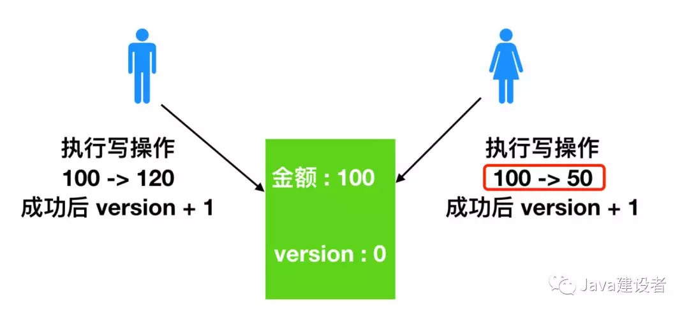

##                                                                             看完你就应该能明白的悲观锁和乐观锁                       

​                                                                                                                                                                                             [                         后端技术精选                      ](javascript:void(0);)                                                                   *1周前*                      

[                     文章转载自公众号                                                                                                                                  Java建设者                                         ，                                            作者                                            elliotts                                                                                ](https://mp.weixin.qq.com/s?__biz=MzU2MTI4MjI0MQ==&mid=2247487574&idx=2&sn=5b869a6ab21d68d186be6226019d32e4&chksm=fc7a7df8cb0df4ee92126b81f617844b35efad9962671bf01508902f09f048fb9dfa67d185ef&scene=21##)

> 来源：Java建设者

Java 按照锁的实现分为乐观锁和悲观锁，乐观锁和悲观锁并不是一种真实存在的锁，而是一种设计思想，乐观锁和悲观锁对于理解 Java 多线程和数据库来说至关重要，那么本篇文章就来详细探讨一下这两种锁的概念以及实现方式。

## 悲观锁

`悲观锁`是一种悲观思想，它总认为最坏的情况可能会出现，它认为数据很可能会被其他人所修改，所以悲观锁在持有数据的时候总会把`资源` 或者 `数据` 锁住，这样其他线程想要请求这个资源的时候就会阻塞，直到等到悲观锁把资源释放为止。传统的关系型数据库里边就用到了很多这种锁机制，**比如行锁，表锁等，读锁，写锁等，都是在做操作之前先上锁**。悲观锁的实现往往依靠数据库本身的锁功能实现。

Java 中的 `Synchronized` 和 `ReentrantLock` 等独占锁(排他锁)也是一种悲观锁思想的实现，因为 Synchronzied 和 ReetrantLock 不管是否持有资源，它都会尝试去加锁，生怕自己心爱的宝贝被别人拿走。

## 乐观锁

乐观锁的思想与悲观锁的思想相反，它总认为资源和数据不会被别人所修改，所以读取不会上锁，但是乐观锁在进行写入操作的时候会判断当前数据是否被修改过(具体如何判断我们下面再说)。乐观锁的实现方案一般来说有两种：`版本号机制` 和 `CAS实现` 。乐观锁多适用于多读的应用类型，这样可以提高吞吐量。

在Java中`java.util.concurrent.atomic`包下面的原子变量类就是使用了乐观锁的一种实现方式CAS实现的。

## 两种锁的使用场景

上面介绍了两种锁的基本概念，并提到了两种锁的适用场景，一般来说，悲观锁不仅会对写操作加锁还会对读操作加锁，一个典型的悲观锁调用：

```
select * from student where name="cxuan" for update
```

这条 sql 语句从 Student 表中选取 name = "cxuan" 的记录并对其加锁，那么其他写操作再这个事务提交之前都不会对这条数据进行操作，起到了独占和排他的作用。

悲观锁因为对读写都加锁，所以它的性能比较低，对于现在互联网提倡的`三高`(高性能、高可用、高并发)来说，悲观锁的实现用的越来越少了，但是一般多读的情况下还是需要使用悲观锁的，因为虽然加锁的性能比较低，但是也阻止了像乐观锁一样，遇到写不一致的情况下一直重试的时间。

相对而言，乐观锁用于读多写少的情况，即很少发生冲突的场景，这样可以省去锁的开销，增加系统的吞吐量。

乐观锁的适用场景有很多，典型的比如说成本系统，柜员要对一笔金额做修改，为了保证数据的准确性和实效性，使用悲观锁锁住某个数据后，再遇到其他需要修改数据的操作，那么此操作就无法完成金额的修改，对产品来说是灾难性的一刻，使用乐观锁的版本号机制能够解决这个问题，我们下面说。

## 乐观锁的实现方式

乐观锁一般有两种实现方式：采用`版本号机制` 和 `CAS（Compare-and-Swap，即比较并替换）算法`实现。

### 版本号机制

版本号机制是在数据表中加上一个 `version`  字段来实现的，表示数据被修改的次数，当执行写操作并且写入成功后，version = version +  1，当线程A要更新数据时，在读取数据的同时也会读取 version 值，在提交更新时，若刚才读取到的 version  值为当前数据库中的version值相等时才更新，否则重试更新操作，直到更新成功。

我们以上面的金融系统为例，来简述一下这个过程。


- 成本系统中有一个数据表，表中有两个字段分别是 `金额` 和 `version`，金额的属性是能够实时变化，而 version 表示的是金额每次发生变化的版本，一般的策略是，当金额发生改变时，version 采用递增的策略每次都在上一个版本号的基础上 + 1。

- 在了解了基本情况和基本信息之后，我们来看一下这个过程：公司收到回款后，需要把这笔钱放在金库中，假如金库中存有100 元钱

- - 下面开启事务一：当男柜员执行回款写入操作前，他会先查看(读)一下金库中还有多少钱，此时读到金库中有  100 元，可以执行写操作，并把数据库中的钱更新为 120 元，提交事务，金库中的钱由 100 -> 120，version的版本号由 0  -> 1。
  - 开启事务二：女柜员收到给员工发工资的请求后，需要先执行读请求，查看金库中的钱还有多少，此时的版本号是多少，然后从金库中取出员工的工资进行发放，提交事务，成功后版本 + 1，此时版本由 1 -> 2。

**上面两种情况是最乐观的情况，上面的两个事务都是顺序执行的，也就是事务一和事务二互不干扰，那么事务要并行执行会如何呢？**



- 事务一开启，男柜员先执行读操作，取出金额和版本号，执行写操作

  ```
  beginupdate 表 set 金额 = 120,version = version + 1 where 金额 = 100 and version = 0
  ```

  此时金额改为 120，版本号为1，事务还没有提交

  事务二开启，女柜员先执行读操作，取出金额和版本号，执行写操作

  ```
  beginupdate 表 set 金额 = 50,version = version + 1 where 金额 = 100 and version = 0
  ```

  此时金额改为 50，版本号变为 1，事务未提交

  现在提交事务一，金额改为 120，版本变为1，提交事务。理想情况下应该变为 金额 = 50，版本号 = 2，但是实际上事务二 的更新是建立在金额为 100 和 版本号为 0 的基础上的，所以事务二不会提交成功，应该重新读取金额和版本号，再次进行写操作。

  这样，就避免了女柜员 用基于 version=0 的旧数据修改的结果覆盖男操作员操作结果的可能。

### CAS 算法

先来看一道经典的并发执行 1000次递增和递减后的问题：

```
public class Counter {    int count = 0;    public int getCount() {        return count;    }    public void setCount(int count) {        this.count = count;    }    public void add(){        count += 1;    }    public void dec(){        count -= 1;    }}
public class Consumer extends Thread{    Counter counter;    public Consumer(Counter counter){        this.counter = counter;    }    @Override    public void run() {        for(int j = 0;j < Test.LOOP;j++){            counter.dec();        }    }}public class Producer extends Thread{    Counter counter;    public Producer(Counter counter){        this.counter = counter;    }    @Override    public void run() {        for(int i = 0;i < Test.LOOP;++i){            counter.add();        }    }}public class Test {    final static int LOOP = 1000;    public static void main(String[] args) throws InterruptedException {        Counter counter = new Counter();        Producer producer = new Producer(counter);        Consumer consumer = new Consumer(counter);        producer.start();        consumer.start();        producer.join();        consumer.join();        System.out.println(counter.getCount());    }}
```

多次测试的结果都不为 0，也就是说出现了并发后数据不一致的问题，原因是 count -= 1 和 count += 1 都是非原子性操作，它们的执行步骤分为三步：

- 从内存中读取 count 的值，把它放入寄存器中
- 执行 + 1 或者 - 1 操作
- 执行完成的结果再复制到内存中

如果要把证它们的原子性，必须进行加锁，使用 `Synchronzied` 或者 `ReentrantLock`，我们前面介绍它们是悲观锁的实现，我们现在讨论的是乐观锁，那么用哪种方式保证它们的原子性呢？请继续往下看

CAS 即 `compare and swap（比较与交换）`，是一种有名的无锁算法。即不使用锁的情况下实现多线程之间的变量同步，也就是在没有线程被阻塞的情况下实现变量的同步，所以也叫非阻塞同步（Non-blocking Synchronization

CAS 中涉及三个要素：

- 需要读写的内存值 V
- 进行比较的值 A
- 拟写入的新值 B

当且仅当预期值A和内存值V相同时，将内存值V修改为B，否则什么都不做。

JAVA对CAS的支持：在JDK1.5 中新添加 java.util.concurrent (J.U.C) 就是建立在 CAS 之上的。对于 synchronized 这种阻塞算法，CAS是非阻塞算法的一种实现。所以J.U.C在性能上有了很大的提升。

我们以 java.util.concurrent 中的`AtomicInteger` 为例，看一下在不用锁的情况下是如何保证线程安全的

```
public class AtomicCounter {    private AtomicInteger integer = new AtomicInteger();    public AtomicInteger getInteger() {        return integer;    }    public void setInteger(AtomicInteger integer) {        this.integer = integer;    }    public void increment(){        integer.incrementAndGet();    }    public void decrement(){        integer.decrementAndGet();    }}public class AtomicProducer extends Thread{    private AtomicCounter atomicCounter;    public AtomicProducer(AtomicCounter atomicCounter){        this.atomicCounter = atomicCounter;    }    @Override    public void run() {        for(int j = 0; j < AtomicTest.LOOP; j++) {            System.out.println("producer : " + atomicCounter.getInteger());            atomicCounter.increment();        }    }}public class AtomicConsumer extends Thread{    private AtomicCounter atomicCounter;    public AtomicConsumer(AtomicCounter atomicCounter){        this.atomicCounter = atomicCounter;    }    @Override    public void run() {        for(int j = 0; j < AtomicTest.LOOP; j++) {            System.out.println("consumer : " + atomicCounter.getInteger());            atomicCounter.decrement();        }    }}public class AtomicTest {    final static int LOOP = 10000;    public static void main(String[] args) throws InterruptedException {        AtomicCounter counter = new AtomicCounter();        AtomicProducer producer = new AtomicProducer(counter);        AtomicConsumer consumer = new AtomicConsumer(counter);        producer.start();        consumer.start();        producer.join();        consumer.join();        System.out.println(counter.getInteger());    }}
```

经测试可得，不管循环多少次最后的结果都是0，也就是多线程并行的情况下，使用 AtomicInteger 可以保证线程安全性。incrementAndGet 和 decrementAndGet 都是原子性操作。本篇文章暂不探讨它们的实现方式。

## 乐观锁的缺点

任何事情都是有利也有弊，软件行业没有完美的解决方案只有最优的解决方案，所以乐观锁也有它的弱点和缺陷：

### ABA 问题

ABA  问题说的是，如果一个变量第一次读取的值是 A，准备好需要对 A 进行写操作的时候，发现值还是 A，那么这种情况下，能认为 A  的值没有被改变过吗？可以是由 A -> B -> A 的这种情况，但是 AtomicInteger  却不会这么认为，它只相信它看到的，它看到的是什么就是什么。

JDK 1.5 以后的 `AtomicStampedReference`类就提供了此种能力，其中的 `compareAndSet 方法`就是首先检查当前引用是否等于预期引用，并且当前标志是否等于预期标志，如果全部相等，则以原子方式将该引用和该标志的值设置为给定的更新值。

也可以采用CAS的一个变种DCAS来解决这个问题。DCAS，是对于每一个V增加一个引用的表示修改次数的标记符。对于每个V，如果引用修改了一次，这个计数器就加1。然后再这个变量需要update的时候，就同时检查变量的值和计数器的值。

### 循环开销大

我们知道乐观锁在进行写操作的时候会判断是否能够写入成功，如果写入不成功将触发等待 -> 重试机制，这种情况是一个自旋锁，简单来说就是适用于短期内获取不到，进行等待重试的锁，它不适用于长期获取不到锁的情况，另外，自旋循环对于性能开销比较大。

## CAS与synchronized的使用情景

简单的来说 CAS 适用于写比较少的情况下（多读场景，冲突一般较少），synchronized 适用于写比较多的情况下（多写场景，冲突一般较多）

- 对于资源竞争较少（线程冲突较轻）的情况，使用 synchronized 同步锁进行线程阻塞和唤醒切换以及用户态内核态间的切换操作额外浪费消耗 cpu 资源；而 CAS 基于硬件实现，不需要进入内核，不需要切换线程，操作自旋几率较少，因此可以获得更高的性能。
- 对于资源竞争严重（线程冲突严重）的情况，CAS 自旋的概率会比较大，从而浪费更多的 CPU 资源，效率低于 synchronized。

> 补充：Java并发编程这个领域中  synchronized 关键字一直都是元老级的角色，很久之前很多人都会称它为 “重量级锁” 。但是，在JavaSE  1.6之后进行了主要包括为了减少获得锁和释放锁带来的性能消耗而引入的 偏向锁 和 轻量级锁  以及其它各种优化之后变得在某些情况下并不是那么重了。synchronized 的底层实现主要依靠 Lock-Free 的队列，基本思路是  自旋后阻塞，竞争切换后继续竞争锁，稍微牺牲了公平性，但获得了高吞吐量。在线程冲突较少的情况下，可以获得和 CAS  类似的性能；而线程冲突严重的情况下，性能远高于CAS。

相关参考：

**Java 多线程之悲观锁与乐观锁**[1]

https://baike.baidu.com/item/悲观锁

   

***推荐阅读(点击即可跳转阅读)***

**1.** [SpringBoot内容聚合](http://mp.weixin.qq.com/s?__biz=MzI4Njc5NjM1NQ==&mid=2247488811&idx=2&sn=0d054027651bef114ae6bec5a8f62359&chksm=ebd62a07dca1a3111269692dd9b0a5ab8af7d2038b8ec6600a057573364e76db1332adc5fd46&scene=21#wechat_redirect)

**2.** [面试题内容聚合](http://mp.weixin.qq.com/s?__biz=MzI4Njc5NjM1NQ==&mid=2247488811&idx=3&sn=b04d8fdacf575c7ec959de4107f31091&chksm=ebd62a07dca1a31186f7f62de60ba7c7a88db26233562ed7183c6f609c5e7f4ffb448f30375f&scene=21#wechat_redirect)

**3.** [设计模式内容聚合](http://mp.weixin.qq.com/s?__biz=MzI4Njc5NjM1NQ==&mid=2247488811&idx=4&sn=ec20f59a5b67a59d98d221bd20d78448&chksm=ebd62a07dca1a31188dafea0e6984b4883fa972a32ff31da2df6f52fcc73b56c6c9454751d73&scene=21#wechat_redirect)

**4.** [Mybatis内容聚合](http://mp.weixin.qq.com/s?__biz=MzI4Njc5NjM1NQ==&mid=2247488945&idx=2&sn=2c0326af621ac51f33720e2608121cef&chksm=ebd62a9ddca1a38b8e284b413a8eea08aa452fdeda3c4740325803514d30029a2ab4af5bdfed&scene=21#wechat_redirect)

**5.** [多线程内容聚合](http://mp.weixin.qq.com/s?__biz=MzI4Njc5NjM1NQ==&mid=2247488811&idx=6&sn=a769526cf5c4dfc5b0f8e5a40f984cff&chksm=ebd62a07dca1a3116cc6c45ceb7a81d47293b9811c8df97b5ca363c6370ffccfd913bab3599f&scene=21#wechat_redirect)

