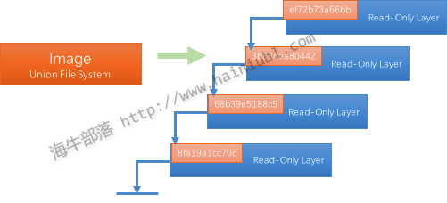

**写的非常好的一篇文章，不知道为什么被删除了。  利用Google快照，做个存档。**

**快照地址：地址**

**作者地址:青牛**

## **什么是docker**

Docker 是一个开源项目，诞生于 2013 年初，最初是 dotCloud 公司内部的一个业余项目。它基于 Google 公司推出的  Go 语言实现。 项目后来加入了 Linux 基金会，遵从了 Apache 2.0 协议，项目代码在 GitHub 上进行维护。

Docker 自开源后受到广泛的关注和讨论，以至于 dotCloud 公司后来都改名为 Docker Inc。Redhat 已经在其 RHEL6.5 中集中支持 Docker；Google 也在其 PaaS 产品中广泛应用。

Docker 项目的目标是实现轻量级的操作系统虚拟化解决方案。 Docker 的基础是 Linux 容器（LXC）等技术。在 LXC  的基础上 Docker 进行了进一步的封装，让用户不需要去关心容器的管理，使得操作更为简便。用户操作 Docker  的容器就像操作一个快速轻量级的虚拟机一样简单。

下面的图片比较了 Docker 和传统虚拟化方式的不同之处，可见容器是在操作系统层面上实现虚拟化，直接复用本地主机的操作系统，而传统方式则是在硬件层面实现。


## 为什么用docker[ ](http://hainiubl.com/topics/13#为什么用docker)

作为一种新兴的虚拟化方式，Docker 跟传统的虚拟化方式相比具有众多的优势。

Docker 在如下几个方面具有较大的优势：

- 更快速的交付和部署

Docker在整个开发周期都可以完美的辅助你实现快速交付。Docker允许开发者在装有应用和服务本地容器做开发。可以直接集成到可持续开发流程中。

例如：开发者可以使用一个标准的镜像来构建一套开发容器，开发完成之后，运维人员可以直接使用这个容器来部署代码。 Docker  可以快速创建容器，快速迭代应用程序，并让整个过程全程可见，使团队中的其他成员更容易理解应用程序是如何创建和工作的。 Docker  容器很轻很快！容器的启动时间是秒级的，大量地节约开发、测试、部署的时间。

- 高效的部署和扩容

Docker 容器几乎可以在任意的平台上运行，包括物理机、虚拟机、公有云、私有云、个人电脑、服务器等。 这种兼容性可以让用户把一个应用程序从一个平台直接迁移到另外一个。

Docker的兼容性和轻量特性可以很轻松的实现负载的动态管理。你可以快速扩容或方便的下线的你的应用和服务，这种速度趋近实时。

- 更高的资源利用率

Docker 对系统资源的利用率很高，一台主机上可以同时运行数千个 Docker  容器。容器除了运行其中应用外，基本不消耗额外的系统资源，使得应用的性能很高，同时系统的开销尽量小。传统虚拟机方式运行 10 个不同的应用就要起  10 个虚拟机，而Docker 只需要启动 10 个隔离的应用即可。

- 更简单的管理

使用 Docker，只需要小小的修改，就可以替代以往大量的更新工作。所有的修改都以增量的方式被分发和更新，从而实现自动化并且高效的管理。

## Docker引擎[ ](http://hainiubl.com/topics/13#Docker引擎)

docker引擎是一个c/s结构的应用，主要组件见下图：


- Server是一个常驻进程
- REST API 实现了client和server间的交互协议
- CLI 实现容器和镜像的管理，为用户提供统一的操作界面

## Docker构架[ ](http://hainiubl.com/topics/13#Docker构架)

Docker使用C/S架构，Client 通过接口与Server进程通信实现容器的构建，运行和发布。client和server可以运行在同一台集群，也可以通过跨主机实现远程通信。


## 核心概念[ ](http://hainiubl.com/topics/13#核心概念)

- 镜像(image)

Docker 镜像（Image）就是一个只读的模板。例如：一个镜像可以包含一个完整的操作系统环境，里面仅安装了 Apache  或用户需要的其它应用程序。镜像可以用来创建 Docker 容器，一个镜像可以创建很多容器。Docker  提供了一个很简单的机制来创建镜像或者更新现有的镜像，用户甚至可以直接从其他人那里下载一个已经做好的镜像来直接使用。

镜像（Image）就是一堆只读层（read-only layer）的统一视角，也许这个定义有些难以理解，看看下面这张图：


右边我们看到了多个只读层，它们重叠在一起。除了最下面一层，其它层都会有一个指针指向下一层。这些层是Docker内部的实现细节，并且能够在docker宿主机的文件系统上访问到。统一文件系统（Union  File  System）技术能够将不同的层整合成一个文件系统，为这些层提供了一个统一的视角，这样就隐藏了多层的存在，在用户的角度看来，只存在一个文件系统。

- 仓库(repository)

仓库（Repository）是集中存放镜像文件的场所。有时候会把仓库和仓库注册服务器（Registry）混为一谈，并不严格区分。实际上，仓库注册服务器上往往存放着多个仓库，每个仓库中又包含了多个镜像，每个镜像有不同的标签（tag）。

仓库分为公开仓库（Public）和私有仓库（Private）两种形式。最大的公开仓库是 Docker  Hub，存放了数量庞大的镜像供用户下载。国内的公开仓库包括 时速云 、网易云  等，可以提供大陆用户更稳定快速的访问。当然，用户也可以在本地网络内创建一个私有仓库。

当用户创建了自己的镜像之后就可以使用 push 命令将它上传到公有或者私有仓库，这样下次在另外一台机器上使用这个镜像时候，只需要从仓库上 pull 下来就可以了。

Docker 仓库的概念跟 Git 类似，注册服务器可以理解为 GitHub 这样的托管服务。

- 容器(container)

Docker  利用容器（Container）来运行应用。容器是从镜像创建的运行实例。它可以被启动、开始、停止、删除。每个容器都是相互隔离的、保证安全的平台。可以把容器看做是一个简易版的  Linux 环境（包括root用户权限、进程空间、用户空间和网络空间等）和运行在其中的应用程序。

容器的定义和镜像几乎一模一样，也是一堆层的统一视角，唯一区别在于容器的最上面那一层是可读可写的。


一个运行态容器被定义为一个可读写的统一文件系统加上隔离的进程空间和包含其中的进程。下面这张图片展示了一个运行中的容器。


正是文件系统隔离技术使得Docker成为了一个非常有潜力的虚拟化技术。一个容器中的进程可能会对文件进行修改、删除、创建，这些改变都将作用于可读写层。

## Docker安装部署[ ](http://hainiubl.com/topics/13#Docker安装部署)

docker安装非常简单，支持各种平台，请到官网自行安装下载[docker下载](https://www.docker.com/products/docker)

## Docker常用命令[ ](http://hainiubl.com/topics/13#Docker常用命令)

### 获取镜像[ ](http://hainiubl.com/topics/13#获取镜像)

```php
docker pull
```

从仓库获取所需要的镜像。

使用示例：

```php
docker pull centos:centos6
```

实际上相当于 docker pull registry.hub.docker.com/centos:centos6
命令，即从注册服务器 registry.hub.docker.com 中的 centos 仓库来下载标记为 centos6 的镜像。
有时候官方仓库注册服务器下载较慢，可以从其他仓库下载。 从其它仓库下载时需要指定完整的仓库注册服务器地址。

### 查看镜像列表[#](http://hainiubl.com/topics/13#查看镜像列表)

```php
docker images
```

列出了所有顶层（top-level）镜像。实际上，在这里我们没有办法区分一个镜像和一个只读层，所以我们
提出了top-level镜像。只有创建容器时使用的镜像或者是直接pull下来的镜像能被称为顶层（top-level）
镜像，并且每一个顶层镜像下面都隐藏了多个镜像层。

使用示例：

```php
$ docker images
REPOSITORY               TAG                 IMAGE ID            CREATED             SIZE
centos                   centos6             6a77ab6655b9        8 weeks ago         194.6 MB
ubuntu                   latest              2fa927b5cdd3        9 weeks ago         122 MB
```

在列出信息中，可以看到几个字段信息

- 来自于哪个仓库，比如 ubuntu
- 镜像的标记，比如 14.04
- 它的 ID 号（唯一）
- 创建时间
- 镜像大小

### 利用 Dockerfile 来创建镜像[ ](http://hainiubl.com/topics/13#利用-Dockerfile-来创建镜像)

```php
docker build
```

使用 docker commit 来扩展一个镜像比较简单，但是不方便在一个团队中分享。我们可以使用
docker build 来创建一个新的镜像。为此，首先需要创建一个 Dockerfile，包含一些如何创建镜像的
指令。新建一个目录和一个 Dockerfile。

```php
mkdir hainiu
cd hainiu
touch Dockerfile
```

Dockerfile 中每一条指令都创建镜像的一层，例如：

```php
FROM centos:centos6
MAINTAINER sandywei <sandy@hainiu.tech>
# move all configuration files into container

RUN yum install -y httpd
EXPOSE 80
CMD ["sh","-c","service httpd start;bash"]
```

Dockerfile 基本的语法是

- 使用#来注释
- FROM 指令告诉 Docker 使用哪个镜像作为基础
- 接着是维护者的信息
- RUN开头的指令会在创建中运行，比如安装一个软件包，在这里使用yum来安装了一些软件

更详细的语法说明请参考 [Dockerfile](https://docs.docker.com/engine/reference/builder/)

编写完成 Dockerfile 后可以使用 docker build 来生成镜像。

```php
$ docker build -t hainiu/httpd:1.0 .

Sending build context to Docker daemon 2.048 kB
Step 1 : FROM centos:centos6
 ---> 6a77ab6655b9
Step 2 : MAINTAINER sandywei <sandy@hainiu.tech>
 ---> Running in 1b26493518a7
 ---> 8877ee5f7432
Removing intermediate container 1b26493518a7
Step 3 : RUN yum install -y httpd
 ---> Running in fe5b6f1ef888

 .....

 Step 5 : CMD sh -c service httpd start
 ---> Running in b2b94c1601c2
 ---> 5f9aa91b0c9e
Removing intermediate container b2b94c1601c2
Successfully built 5f9aa91b0c9e
```

其中 -t 标记来添加 tag，指定新的镜像的用户信息。 “.” 是 Dockerfile 所在的路径（当前目录），
也可以替换为一个具体的 Dockerfile 的路径。注意一个镜像不能超过 127 层。

用docker images 查看镜像列表

```php
$ docker images
REPOSITORY                 TAG               IMAGE ID            CREATED             SIZE
hainiu/httpd               1.0               5f9aa91b0c9e        3 minutes ago       292.4 MB
centos                   centos6             6a77ab6655b9        8 weeks ago         194.6 MB
ubuntu                   latest              2fa927b5cdd3        9 weeks ago         122 MB
```

细心的朋友可以看到最后一层的ID（5f9aa91b0c9e）和 image id 是一样的

### 上传镜像[ ](http://hainiubl.com/topics/13#上传镜像)

```php
docker push
```

用户可以通过 docker push 命令，把自己创建的镜像上传到仓库中来共享。例如，用户在 Docker Hub 上完成注册后，可以推送自己的镜像到仓库中。

运行实例：

```php
$ docker push hainiu/httpd:1.0
```

### 创建容器[ ](http://hainiubl.com/topics/13#创建容器)

```php
docker create <image-id>
```

docker create 命令为指定的镜像（image）添加了一个可读写层，构成了一个新的容器。注意，这个容器并没有运行。

docker create 命令提供了许多参数选项可以指定名字，硬件资源，网络配置等等。

运行示例：

创建一个centos的容器，可以使用仓库＋标签的名字确定image，也可以使用image－id指定image。返回容器id

```php
＃查看本地images列表
$ docker images

＃用仓库＋标签
$ docker create -it --name centos6_container centos:centos6

＃使用image－id
$ docker create -it --name centos6_container 6a77ab6655b9 bash
b3cd0b47fe3db0115037c5e9cf776914bd46944d1ac63c0b753a9df6944c7a67

#可以使用 docker ps查看一件存在的容器列表,不加参数默认只显示当前运行的容器
$ docker ps -a
```

可以使用 -v 参数将本地目录挂载到容器中。

```php
$ docker create -it --name centos6_container -v /src/webapp:/opt/webapp centos:centos6
```

这个功能在进行测试的时候十分方便，比如用户可以放置一些程序到本地目录中，来查看容器是否正常工作。本地目录的路径必须是绝对路径，如果目录不存在 Docker 会自动为你创建它。

### 启动容器[ ](http://hainiubl.com/topics/13#启动容器)

```php
docker start <container-id>
```

Docker start命令为容器文件系统创建了一个进程隔离空间。注意，每一个容器只能够有一个进程隔离空间。

运行实例：

```php
#通过名字启动
$ docker start -i centos6_container

＃通过容器ID启动
$ docker start -i b3cd0b47fe3d
```

### 进入容器[ ](http://hainiubl.com/topics/13#进入容器)

```php
docker exec <container-id>
```

在当前容器中执行新命令，如果增加 -it参数运行bash 就和登录到容器效果一样的。

```php
docker exec -it centos6_container bash
```

### 停止容器[#](http://hainiubl.com/topics/13#停止容器)

```php
docker stop <container-id>
```

### 删除容器[#](http://hainiubl.com/topics/13#删除容器)

```php
docker rm <container-id>
```

### 运行容器[ ](http://hainiubl.com/topics/13#运行容器)

```php
docker run <image-id>
```

docker run就是docker create和docker start两个命令的组合,支持参数也是一致的，如果指定容器
名字是，容器已经存在会报错,可以增加 --rm 参数实现容器退出时自动删除。

运行示例:

```php
docker create -it --rm --name centos6_container centos:centos6
```

### 查看容器列表[ ](http://hainiubl.com/topics/13#查看容器列表)

```php
docker ps
```

docker ps 命令会列出所有运行中的容器。这隐藏了非运行态容器的存在，如果想要找出这些容器，增加 -a 参数。

### 删除镜像[ ](http://hainiubl.com/topics/13#删除镜像)

```php
docker rmi <image-id>
```

删除构成镜像的一个只读层。你只能够使用docker rmi来移除最顶层（top level layer）
（也可以说是镜像），你也可以使用-f参数来强制删除中间的只读层。

### commit容器[#](http://hainiubl.com/topics/13#commit容器)

```php
docker commit <container-id>
```

将容器的可读写层转换为一个只读层，这样就把一个容器转换成了不可变的镜像。

### 镜像保存[#](http://hainiubl.com/topics/13#镜像保存)

```php
docker save <image-id>
```

创建一个镜像的压缩文件，这个文件能够在另外一个主机的Docker上使用。和export命令不同，这个命令
为每一个层都保存了它们的元数据。这个命令只能对镜像生效。

使用示例:

```php
#保存centos镜像到centos_images.tar 文件
$ docker save  -o centos_images.tar centos:centos6

＃或者直接重定向
$ docker save  -o centos_images.tar centos:centos6 > centos_images.tar
```

### 容器导出[ ](http://hainiubl.com/topics/13#容器导出)

```php
docker export <container-id>
```

创建一个tar文件，并且移除了元数据和不必要的层，将多个层整合成了一个层，只保存了当前统一视角看到
的内容。expoxt后的容器再import到Docker中，只有一个容器当前状态的镜像；而save后的镜像则不同，
它能够看到这个镜像的历史镜像。

### inspect[ ](http://hainiubl.com/topics/13#inspect)

```php
docker inspect <container-id> or <image-id>
```

docker inspect命令会提取出容器或者镜像最顶层的元数据

**版权声明:原创作品,允许转载，转载时务必以超链接的形式表明出处和作者信息。否则将追究法律责任。来自海牛部落－青牛,http://hainiubl.com/topics/13**